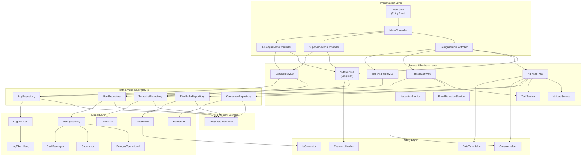
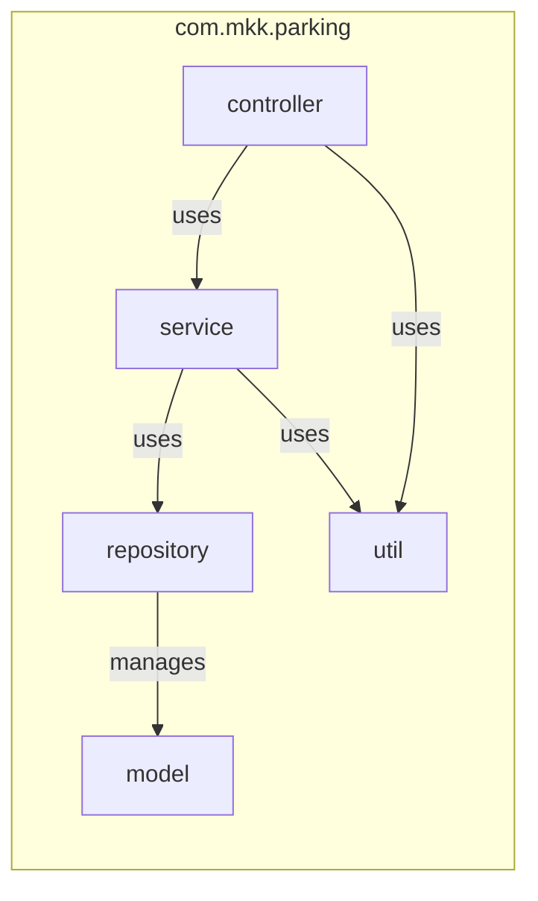
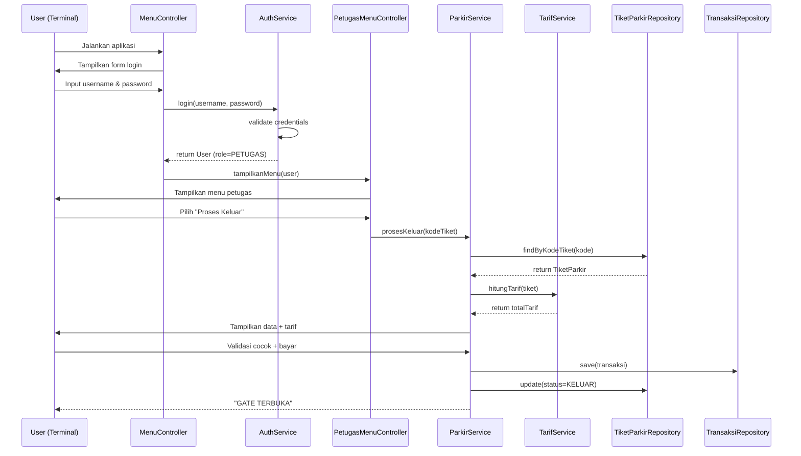

# Arsitektur Sistem — Sistem Parkir MKK

> **Versi**: 1.1 — Java Terminal Application
> **Mata Kuliah**: DPBO (Dasar Pemrograman Berorientasi Objek)
> **Terakhir Diperbarui**: Mei 2026
> **Referensi Elisitasi**: FR-01 s/d FR-10 (Laporan Elisitasi RKPL)

---

## Ringkasan Arsitektur

Sistem Parkir MKK menggunakan arsitektur **Layered Architecture (3-Tier)** yang diimplementasikan sebagai aplikasi Java terminal. Arsitektur ini memisahkan concerns menjadi layer yang berbeda, memudahkan maintenance dan testing, serta mendemonstrasikan prinsip-prinsip OOP.

---

## Diagram Arsitektur



---

## Detail Layer

### 1. Presentation Layer (UI Terminal)

**Tanggung Jawab**: Menampilkan menu, menerima input dari pengguna, menampilkan output.

| Kelas | Fungsi |
|-------|--------|
| `Main` | Entry point aplikasi, inisialisasi data dummy, memulai loop utama |
| `MenuController` | Controller utama yang merutekan ke menu sesuai role user yang login |
| `PetugasMenuController` | Menu dan alur untuk Petugas Operasional |
| `SupervisorMenuController` | Menu dan alur untuk Supervisor |
| `KeuanganMenuController` | Menu dan alur untuk Staff Keuangan |

**Prinsip**: Controller **tidak boleh** mengandung business logic — hanya memanggil Service.

### 2. Service / Business Layer

**Tanggung Jawab**: Logika bisnis utama, validasi, perhitungan, orkestrasi antar repository.

| Kelas | Fungsi | Design Pattern |
|-------|--------|----------------|
| `AuthService` | Login, logout, validasi session, ganti password | **Singleton** |
| `ParkirService` | Registrasi masuk, proses keluar, gate control | — |
| `TransaksiService` | Simpan transaksi, query riwayat | — |
| `TiketHilangService` | Alur tiket hilang, hitung denda, simpan log | — |
| `LaporanService` | Generate berbagai jenis laporan, rekonsiliasi | **Template Method** |
| `ValidasiService` | Validasi visual, perbandingan identitas | — |
| `TarifService` | Perhitungan tarif berdasarkan strategi | **Strategy** |
| `KapasitasService` | Cek okupansi parkiran, tentukan status (LANCAR/RAMAI/HAMPIR_PENUH/PENUH) | — |
| `FraudDetectionService` | Orkestrasi rule-based fraud detection post-transaksi | **Chain of Responsibility** |

### 3. Data Access Layer (DAO / Repository)

**Tanggung Jawab**: Abstraksi akses data. Semua operasi CRUD ke storage in-memory.

| Kelas | Entitas yang Dikelola | Operasi |
|-------|----------------------|---------|
| `UserRepository` | `User` (dan subclass-nya) | findByUsername, findAll, save, delete |
| `KendaraanRepository` | `Kendaraan` | findByPlatNomor, save |
| `TiketParkirRepository` | `TiketParkir` | findByKodeTiket, findActiveByPlat, save, update |
| `TransaksiRepository` | `Transaksi` | findByTanggal, findAll, save |
| `LogRepository` | `LogAktivitas`, `LogTiketHilang` | findAll, findByFilter, save |

**Implementasi**: Semua menggunakan `ArrayList<T>` sebagai penyimpanan internal.

### 4. Model Layer (Entity / Domain)

**Tanggung Jawab**: Representasi data bisnis dengan encapsulation.

> Detail lengkap ada di dokumen `teknis-diagram.md` (Class Diagram).

### 5. Utility Layer

| Kelas | Fungsi |
|-------|--------|
| `ConsoleHelper` | Format output terminal (tabel, box, warna ANSI) |
| `PasswordHasher` | Hash dan verify password (simple hash untuk demo) |
| `DateTimeHelper` | Format tanggal, hitung durasi, parse input tanggal |
| `IdGenerator` | Generate kode tiket unik (TKT-YYYYMMDD-NNN) |

---

## Komponen Diagram



### Struktur Package

```
com.mkk.parking/
├── Main.java
├── controller/
│   ├── MenuController.java
│   ├── PetugasMenuController.java
│   ├── SupervisorMenuController.java
│   └── KeuanganMenuController.java
├── service/
│   ├── AuthService.java
│   ├── ParkirService.java
│   ├── TransaksiService.java
│   ├── TiketHilangService.java
│   ├── LaporanService.java
│   ├── ValidasiService.java
│   ├── TarifService.java
│   └── strategy/
│       ├── TarifStrategy.java          (interface)
│       ├── TarifNormalStrategy.java
│       └── TarifTiketHilangStrategy.java
├── repository/
│   ├── UserRepository.java
│   ├── KendaraanRepository.java
│   ├── TiketParkirRepository.java
│   ├── TransaksiRepository.java
│   └── LogRepository.java
├── model/
│   ├── User.java                       (abstract class)
│   ├── PetugasOperasional.java
│   ├── Supervisor.java
│   ├── StaffKeuangan.java
│   ├── Kendaraan.java
│   ├── TiketParkir.java
│   ├── Transaksi.java
│   ├── LogAktivitas.java
│   ├── LogTiketHilang.java
│   └── enums/
│       ├── Role.java
│       ├── StatusTiket.java
│       ├── JenisKendaraan.java
│       └── JenisTransaksi.java
├── util/
│   ├── ConsoleHelper.java
│   ├── PasswordHasher.java
│   ├── DateTimeHelper.java
│   └── IdGenerator.java
└── observer/
    ├── EventType.java
    ├── EventManager.java
    └── AktivitasLogger.java
```

**Package baru (dari fitur inovasi):**
```
com.mkk.parking/
├── service/
│   ├── capacity/
│   │   ├── KapasitasService.java
│   │   └── StatusParkiran.java         (enum)
│   └── fraud/
│       ├── FraudDetectionService.java
│       ├── FraudRule.java              (interface)
│       ├── TiketHilangFrequencyRule.java
│       ├── DurasiAnomalRule.java
│       ├── DuplikasiPlatRule.java
│       ├── FraudAlert.java             (value object)
│       └── FraudSeverity.java          (enum)
└── model/
    └── enums/
        └── StatusParkiran.java
```

---

## Alur Eksekusi (Sequence)



---

## Design Patterns yang Digunakan

### 1. Singleton Pattern — `AuthService`

```java
public class AuthService {
    private static AuthService instance;
    private User currentUser;

    private AuthService() {}

    public static AuthService getInstance() {
        if (instance == null) {
            instance = new AuthService();
        }
        return instance;
    }

    public User login(String username, String password) { ... }
    public void logout() { ... }
    public User getCurrentUser() { return currentUser; }
}
```

**Alasan**: Hanya boleh ada satu sesi login aktif dalam satu aplikasi terminal.

---

### 2. Strategy Pattern — `TarifStrategy`

```java
public interface TarifStrategy {
    double hitungTarif(TiketParkir tiket);
    String getNamaStrategy();
}

public class TarifNormalStrategy implements TarifStrategy {
    @Override
    public double hitungTarif(TiketParkir tiket) {
        long jam = hitungDurasiJam(tiket);
        return jam * tiket.getKendaraan().getTarifPerJam();
    }
}

public class TarifTiketHilangStrategy implements TarifStrategy {
    private static final double DENDA_TIKET_HILANG = 25_000;

    @Override
    public double hitungTarif(TiketParkir tiket) {
        long jam = hitungDurasiJam(tiket);
        return (jam * tiket.getKendaraan().getTarifPerJam()) + DENDA_TIKET_HILANG;
    }
}
```

**Alasan**: Strategi tarif bisa berubah (normal, tiket hilang, hari libur) tanpa mengubah kode pemanggil.

---

### 3. Observer Pattern — `EventManager`

```java
public class EventManager {
    private Map<EventType, List<EventListener>> listeners = new HashMap<>();

    public void subscribe(EventType type, EventListener listener) { ... }
    public void notify(EventType type, Object data) { ... }
}

public class AktivitasLogger implements EventListener {
    @Override
    public void onEvent(EventType type, Object data) {
        // Simpan log aktivitas otomatis
    }
}
```

**Alasan**: Setiap event (masuk, keluar, tiket hilang) otomatis di-log tanpa harus memanggil logger di setiap tempat.

---

### 4. Factory Pattern — `UserFactory`

```java
public class UserFactory {
    public static User createUser(String nama, String username, String password, Role role) {
        return switch (role) {
            case PETUGAS_OPERASIONAL -> new PetugasOperasional(nama, username, password);
            case SUPERVISOR -> new Supervisor(nama, username, password);
            case STAFF_KEUANGAN -> new StaffKeuangan(nama, username, password);
        };
    }
}
```

**Alasan**: Pembuatan objek User terstandarisasi, penambahan role baru cukup di satu tempat.

---

### 5. DAO (Data Access Object) Pattern — Repository Classes

```java
public class UserRepository {
    private final List<User> users = new ArrayList<>();

    public void save(User user) { users.add(user); }
    public User findByUsername(String username) { ... }
    public List<User> findAll() { return new ArrayList<>(users); }
    public boolean delete(String username) { ... }
}
```

**Alasan**: Abstraksi akses data — jika di fase berikutnya storage berubah ke database, hanya layer Repository yang berubah.

---

## Architecture Decision Records (ADR)

### ADR-001: Arsitektur Layered (3-Tier)

| Aspek | Detail |
|-------|--------|
| **Status** | Diterima |
| **Konteks** | Proyek ini adalah tugas besar DPBO yang perlu menunjukkan pemahaman OOP |
| **Keputusan** | Menggunakan arsitektur Layered: Presentation → Service → Data Access |
| **Alternatif** | MVC tradisional, Clean Architecture |
| **Alasan** | Layered Architecture paling cocok untuk skala proyek ini, mudah dipahami, dan tetap memisahkan concerns dengan baik |
| **Konsekuensi (+)** | Kode terstruktur, mudah di-maintain, setiap layer bisa ditest independen |
| **Konsekuensi (-)** | Bisa terasa over-engineered untuk aplikasi kecil |

### ADR-002: In-Memory Storage (ArrayList/HashMap)

| Aspek | Detail |
|-------|--------|
| **Status** | Diterima |
| **Konteks** | Proyek fokus pada OOP, bukan database management |
| **Keputusan** | Menggunakan ArrayList dan HashMap sebagai storage in-memory |
| **Alternatif** | SQLite (embedded DB), file-based (CSV/JSON), H2 Database |
| **Alasan** | Menghilangkan kompleksitas database agar fokus ke konsep OOP, sesuai scope mata kuliah |
| **Konsekuensi (+)** | Simple, tidak perlu driver/dependency tambahan, cepat |
| **Konsekuensi (-)** | Data hilang saat aplikasi ditutup, tidak cocok untuk produksi |
| **Mitigasi** | Gunakan data dummy yang di-preload saat startup |

### ADR-003: Java sebagai Bahasa Implementasi

| Aspek | Detail |
|-------|--------|
| **Status** | Diterima (ditetapkan oleh mata kuliah) |
| **Konteks** | DPBO menggunakan Java sebagai bahasa utama |
| **Keputusan** | Java 17+ dengan fitur modern (enhanced switch, text blocks, records) |
| **Konsekuensi (+)** | Dukungan OOP yang kuat, ekosistem matang |
| **Konsekuensi (-)** | Verbose dibanding bahasa modern lain |

---

## Non-Functional Requirements (Pemetaan Arsitektur)

| NFR | Target | FR Ref | Penerapan Arsitektur |
|-----|--------|--------|---------------------|
| **Performa** | Respon < 2 detik, gate < 1 detik | FR-01, FR-05 | In-memory storage → akses O(n) paling lambat, sangat cepat |
| **Usability** | Max 3 klik/langkah | — | Menu terstruktur dengan max 3 level kedalaman |
| **Security** | Role-based access | FR-04 | AuthService + role checking di setiap MenuController |
| **Reliability** | Uptime 99,8% | Business Rule E | Dalam konteks terminal: error handling robust, tidak crash |
| **Maintainability** | Mudah dimodifikasi | — | Layered architecture + design patterns |
| **Auditability** | Log permanen, tidak bisa dihapus petugas | FR-09 | Observer pattern + LogRepository append-only |

---

## Architecture Decision Records (ADR) — Tambahan

### ADR-004: Rule-Based Fraud Detection

| Aspek | Detail |
|-------|--------|
| **Status** | Diterima |
| **Konteks** | Elisitasi mengungkap bahwa modus tiket hilang dan human error adalah masalah utama (FR-03, FR-09). Saran PRPL Bab 5.2 #3 menyebutkan deteksi aktivitas mencurigakan. |
| **Keputusan** | Menggunakan Rule-Based Fraud Detection dengan interface `FraudRule` dan `FraudDetectionService` sebagai orchestrator |
| **Alternatif** | Machine Learning (terlalu kompleks untuk scope DPBO), Simple threshold (kurang extensible) |
| **Alasan** | Menambahkan 1 design pattern baru (Chain of Responsibility) tanpa merombak flow existing. Extensible — rule baru cukup implement interface. |
| **Konsekuensi (+)** | Deteksi fraud otomatis, kaya OOP pattern, menjawab elisitasi FR-09 |
| **Konsekuensi (-)** | ~8 kelas baru (∶15% growth) |

### ADR-005: Smart Capacity Gate Control

| Aspek | Detail |
|-------|--------|
| **Status** | Diterima |
| **Konteks** | Elisitasi mengungkap bahwa MKK sudah menggunakan pemantauan real-time berdasarkan big data (Bab 1.1 laporan PRPL). Kapasitas parkiran penuh = risiko keamanan. |
| **Keputusan** | Menambahkan `KapasitasService` yang melakukan pengecekan okupansi SEBELUM registrasi masuk |
| **Alternatif** | Manual check oleh petugas, IoT sensor (di luar scope) |
| **Alasan** | Ekstensi natural dari flow masuk yang sudah ada — hanya 1 pengecekan `if` ditambahkan |
| **Konsekuensi (+)** | Pencegahan overcapacity, data untuk dashboard supervisor, menjawab FR-06 |
| **Konsekuensi (-)** | Minimal — 2 kelas baru (KapasitasService + StatusParkiran enum) |
