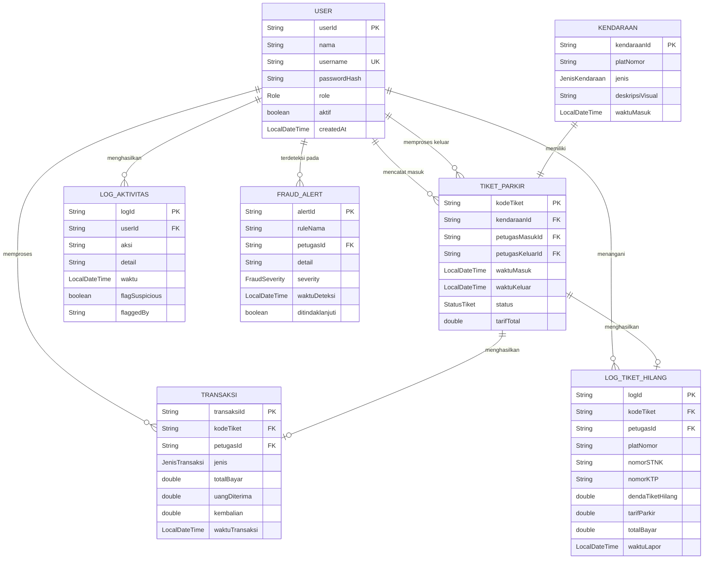

# Desain Database — Sistem Parkir MKK

> **Versi**: 1.1 — Java Terminal Application (In-Memory)
> **Mata Kuliah**: DPBO (Dasar Pemrograman Berorientasi Objek)
> **Terakhir Diperbarui**: Mei 2026
> **Referensi Elisitasi**: FR-01 s/d FR-10 (Laporan Elisitasi RKPL)

---

## Pendahuluan

Pada versi terminal ini, **tidak menggunakan database relasional**. Semua data disimpan secara in-memory menggunakan `ArrayList` dan `HashMap` di Java. Namun, desain data tetap mengikuti prinsip-prinsip database relasional agar:

1. Mudah dimigrasikan ke database sungguhan di fase berikutnya
2. Relasi antar entitas terdokumentasi dengan jelas
3. Integritas data terjaga melalui validasi di kode Java

---

## Entity Relationship Diagram (ERD)



---

## Detail Entitas

### 1. User

Menyimpan data semua pengguna sistem (semua role).

| Atribut | Tipe Java | Keterangan | Constraint |
|---------|-----------|------------|------------|
| `userId` | `String` | ID unik user | PK, auto-generated |
| `nama` | `String` | Nama lengkap | NOT NULL |
| `username` | `String` | Username untuk login | UNIQUE, NOT NULL |
| `passwordHash` | `String` | Password yang sudah di-hash | NOT NULL |
| `role` | `Role` (enum) | PETUGAS_OPERASIONAL / SUPERVISOR / STAFF_KEUANGAN | NOT NULL |
| `aktif` | `boolean` | Status aktif/nonaktif | Default: true |
| `createdAt` | `LocalDateTime` | Waktu registrasi | Auto-set |

**Implementasi Java**:
```java
// Disimpan di UserRepository
private final List<User> users = new ArrayList<>();
private final Map<String, User> usernameIndex = new HashMap<>();
```

---

### 2. Kendaraan

Menyimpan data kendaraan yang masuk area parkir.

| Atribut | Tipe Java | Keterangan | Constraint |
|---------|-----------|------------|------------|
| `kendaraanId` | `String` | ID unik kendaraan | PK, auto-generated |
| `platNomor` | `String` | Nomor plat kendaraan | NOT NULL |
| `jenis` | `JenisKendaraan` (enum) | MOTOR / MOBIL | NOT NULL |
| `deskripsiVisual` | `String` | Deskripsi ciri pengendara (simulasi foto) | NOT NULL |
| `waktuMasuk` | `LocalDateTime` | Waktu kendaraan masuk | Auto-set |

**Implementasi Java**:
```java
// Disimpan di KendaraanRepository
private final List<Kendaraan> kendaraans = new ArrayList<>();
private final Map<String, Kendaraan> platIndex = new HashMap<>();
```

---

### 3. TiketParkir

Tiket yang diberikan ke setiap kendaraan saat masuk. Menjadi penghubung antara kendaraan masuk dan proses keluar/bayar.

| Atribut | Tipe Java | Keterangan | Constraint |
|---------|-----------|------------|------------|
| `kodeTiket` | `String` | Kode tiket unik (TKT-YYYYMMDD-NNN) | PK, auto-generated |
| `kendaraanId` | `String` | Referensi ke Kendaraan | FK → Kendaraan |
| `petugasMasukId` | `String` | Petugas yang memproses masuk | FK → User |
| `petugasKeluarId` | `String` | Petugas yang memproses keluar | FK → User, nullable |
| `waktuMasuk` | `LocalDateTime` | Waktu masuk (copy dari Kendaraan) | NOT NULL |
| `waktuKeluar` | `LocalDateTime` | Waktu keluar | Nullable (diisi saat keluar) |
| `status` | `StatusTiket` (enum) | AKTIF / DIBAYAR / KELUAR / HILANG | NOT NULL |
| `tarifTotal` | `double` | Total tarif yang dihitung | Default: 0 |

**Implementasi Java**:
```java
// Disimpan di TiketParkirRepository
private final List<TiketParkir> tikets = new ArrayList<>();
private final Map<String, TiketParkir> kodeTiketIndex = new HashMap<>();
```

---

### 4. Transaksi

Mencatat setiap pembayaran yang berhasil.

| Atribut | Tipe Java | Keterangan | Constraint |
|---------|-----------|------------|------------|
| `transaksiId` | `String` | ID unik transaksi | PK, auto-generated |
| `kodeTiket` | `String` | Referensi ke TiketParkir | FK → TiketParkir |
| `petugasId` | `String` | Petugas yang memproses | FK → User |
| `jenis` | `JenisTransaksi` (enum) | NORMAL / TIKET_HILANG | NOT NULL |
| `totalBayar` | `double` | Total yang harus dibayar | NOT NULL |
| `uangDiterima` | `double` | Jumlah uang dari customer | NOT NULL |
| `kembalian` | `double` | Sisa kembalian | Computed |
| `waktuTransaksi` | `LocalDateTime` | Waktu transaksi terjadi | Auto-set |

**Implementasi Java**:
```java
// Disimpan di TransaksiRepository
private final List<Transaksi> transaksis = new ArrayList<>();
```

---

### 5. LogTiketHilang

Log khusus untuk setiap kejadian tiket hilang.

| Atribut | Tipe Java | Keterangan | Constraint |
|---------|-----------|------------|------------|
| `logId` | `String` | ID unik log | PK, auto-generated |
| `kodeTiket` | `String` | Tiket yang hilang | FK → TiketParkir |
| `petugasId` | `String` | Petugas yang menangani | FK → User |
| `platNomor` | `String` | Plat nomor kendaraan | NOT NULL |
| `nomorSTNK` | `String` | Nomor STNK pemilik | NOT NULL (sensitif) |
| `nomorKTP` | `String` | Nomor KTP pemilik | NOT NULL (sensitif) |
| `dendaTiketHilang` | `double` | Denda khusus tiket hilang | NOT NULL |
| `tarifParkir` | `double` | Tarif parkir normal | NOT NULL |
| `totalBayar` | `double` | Total (tarif + denda) | NOT NULL |
| `waktuLapor` | `LocalDateTime` | Waktu laporan dibuat | Auto-set |

---

### 6. LogAktivitas

Mencatat semua aktivitas yang terjadi di sistem.

| Atribut | Tipe Java | Keterangan | Constraint |
|---------|-----------|------------|------------|
| `logId` | `String` | ID unik log | PK, auto-generated |
| `userId` | `String` | User yang melakukan aksi | FK → User |
| `aksi` | `String` | Jenis aksi (MASUK, KELUAR, LOGIN, dll) | NOT NULL |
| `detail` | `String` | Detail tambahan | NOT NULL |
| `waktu` | `LocalDateTime` | Waktu aksi | Auto-set |
| `flagSuspicious` | `boolean` | Ditandai mencurigakan | Default: false |
| `flaggedBy` | `String` | Supervisor yang menandai | Nullable |

---

## Enum Values

### Role
```java
public enum Role {
    PETUGAS_OPERASIONAL("Petugas Operasional"),
    SUPERVISOR("Supervisor"),
    STAFF_KEUANGAN("Staff Keuangan");
}
```

### StatusTiket
```java
public enum StatusTiket {
    AKTIF,      // Kendaraan masih di area parkir
    DIBAYAR,    // Sudah bayar, belum keluar
    KELUAR,     // Sudah keluar area parkir
    HILANG      // Tiket hilang (prosedur khusus)
}
```

### JenisKendaraan
```java
public enum JenisKendaraan {
    MOTOR(2_000),   // Tarif per jam: Rp 2.000
    MOBIL(5_000);   // Tarif per jam: Rp 5.000

    private final double tarifPerJam;
}
```

### JenisTransaksi
```java
public enum JenisTransaksi {
    NORMAL,
    TIKET_HILANG
}
```

### StatusParkiran
```java
public enum StatusParkiran {
    LANCAR,         // Okupansi < 50%
    RAMAI,          // Okupansi 50-79%
    HAMPIR_PENUH,   // Okupansi 80-94%
    PENUH;          // Okupansi >= 95%

    private final String label;
}
```

### FraudSeverity
```java
public enum FraudSeverity {
    LOW,    // Informasi saja
    MEDIUM, // Perlu perhatian
    HIGH;   // Perlu tindakan segera
}
```

---

## Index Strategy (In-Memory)

Untuk mempercepat pencarian, beberapa repository menggunakan `HashMap` sebagai index:

| Repository | Key | Value | Tujuan |
|------------|-----|-------|--------|
| `UserRepository` | `username` | `User` | Cepat saat login lookup |
| `KendaraanRepository` | `platNomor` | `Kendaraan` | Cari kendaraan saat tiket hilang |
| `TiketParkirRepository` | `kodeTiket` | `TiketParkir` | Cari tiket saat proses keluar |

---

## Query Examples (Simulasi)

Meskipun menggunakan in-memory, berikut contoh query equivalen jika dimigrasikan ke SQL:

### Mencari tiket aktif berdasarkan plat nomor
```java
// Java (in-memory)
tikets.stream()
    .filter(t -> t.getStatus() == StatusTiket.AKTIF)
    .filter(t -> t.getKendaraan().getPlatNomor().equals(platNomor))
    .findFirst();
```
```sql
-- SQL equivalent
SELECT * FROM tiket_parkir tp
JOIN kendaraan k ON tp.kendaraan_id = k.kendaraan_id
WHERE k.plat_nomor = ? AND tp.status = 'AKTIF';
```

### Laporan pendapatan harian
```java
// Java (in-memory)
transaksis.stream()
    .filter(t -> t.getWaktuTransaksi().toLocalDate().equals(tanggal))
    .mapToDouble(Transaksi::getTotalBayar)
    .sum();
```
```sql
-- SQL equivalent
SELECT SUM(total_bayar) FROM transaksi
WHERE DATE(waktu_transaksi) = ?;
```

### Breakdown pendapatan per jenis kendaraan
```java
// Java (in-memory)
transaksis.stream()
    .filter(t -> t.getWaktuTransaksi().toLocalDate().equals(tanggal))
    .collect(Collectors.groupingBy(
        t -> t.getTiketParkir().getKendaraan().getJenis(),
        Collectors.summarizingDouble(Transaksi::getTotalBayar)
    ));
```
```sql
-- SQL equivalent
SELECT k.jenis, COUNT(*), SUM(t.total_bayar)
FROM transaksi t
JOIN tiket_parkir tp ON t.kode_tiket = tp.kode_tiket
JOIN kendaraan k ON tp.kendaraan_id = k.kendaraan_id
WHERE DATE(t.waktu_transaksi) = ?
GROUP BY k.jenis;
```

---

## Data Dummy (Seed Data)

Data yang di-load saat aplikasi pertama kali dijalankan:

### Users
| userId | nama | username | password | role |
|--------|------|----------|----------|------|
| USR-001 | Budi Santoso | petugas01 | petugas123 | PETUGAS_OPERASIONAL |
| USR-002 | Rina Wati | petugas02 | petugas123 | PETUGAS_OPERASIONAL |
| USR-003 | Andi Pratama | supervisor01 | super123 | SUPERVISOR |
| USR-004 | Sari Dewi | finance01 | finance123 | STAFF_KEUANGAN |

### Kendaraan (pre-parked)
| kendaraanId | platNomor | jenis | deskripsiVisual | waktuMasuk |
|-------------|-----------|-------|-----------------|------------|
| KDR-001 | B 1234 XYZ | MOBIL | Pria, kacamata, jaket hitam | 08:30 |
| KDR-002 | D 5678 ABC | MOTOR | Wanita, hijab putih, tas merah | 07:00 |
| KDR-003 | B 9999 DEF | MOTOR | Pria, helm merah, jaket kulit | 09:00 |

---

## Migrasi ke Database (Fase Berikutnya)

Jika di kemudian hari ingin migrasi ke database relasional:

| Dari (In-Memory) | Ke (Database) | Perubahan |
|-------------------|---------------|-----------|
| `ArrayList<User>` | Tabel `users` (PostgreSQL/MySQL) | Implementasi Repository berubah, interface tetap |
| `HashMap<K,V>` index | Database index (B-Tree) | Otomatis oleh DBMS |
| Filter `stream()` | SQL `WHERE` clause | Query ditulis ulang |
| `LocalDateTime` | `TIMESTAMP` column | Mapping otomatis (JPA/JDBC) |

**Keuntungan arsitektur DAO/Repository**: Hanya layer Repository yang perlu diubah. Service layer dan Presentation layer **tidak berubah sama sekali**.
