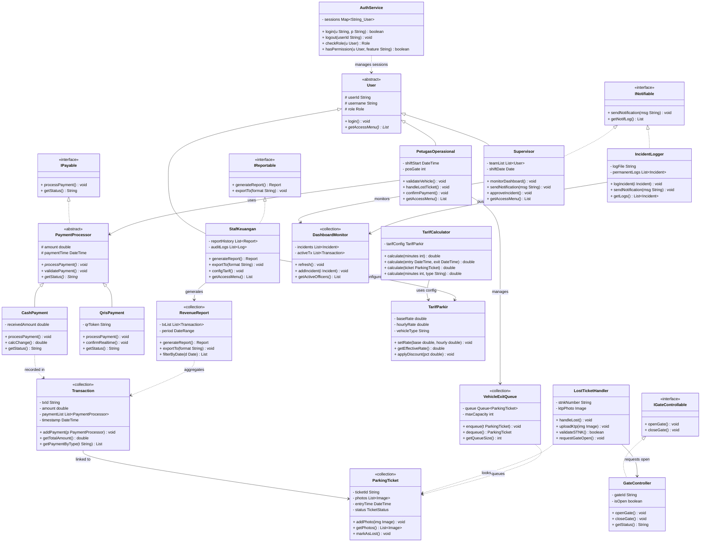
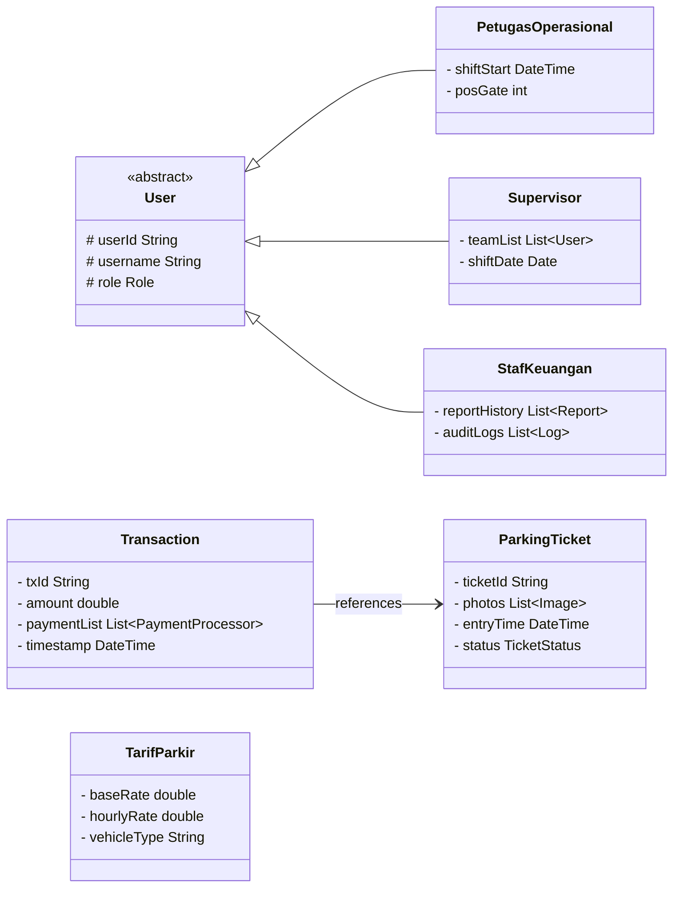
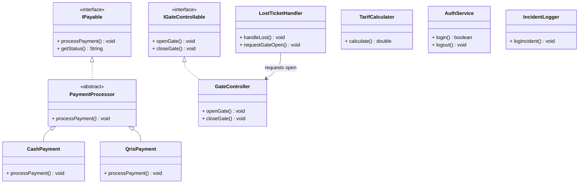
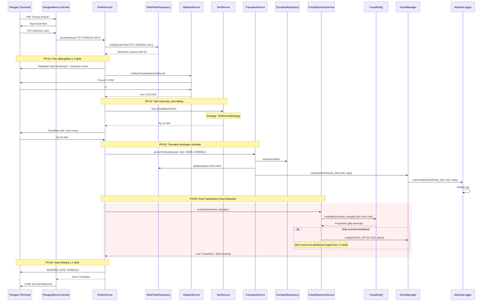
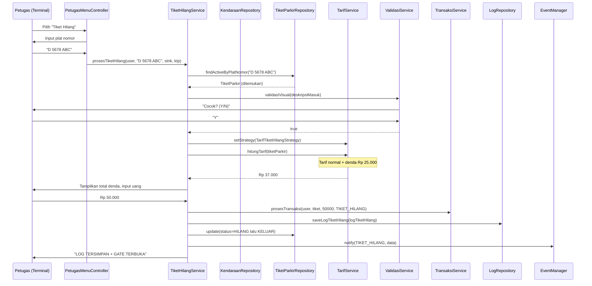
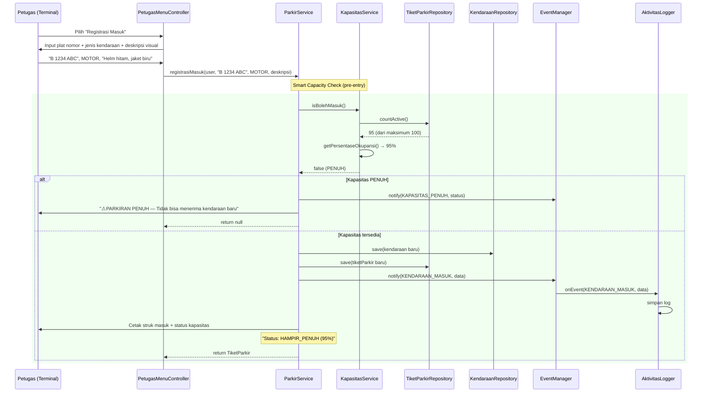
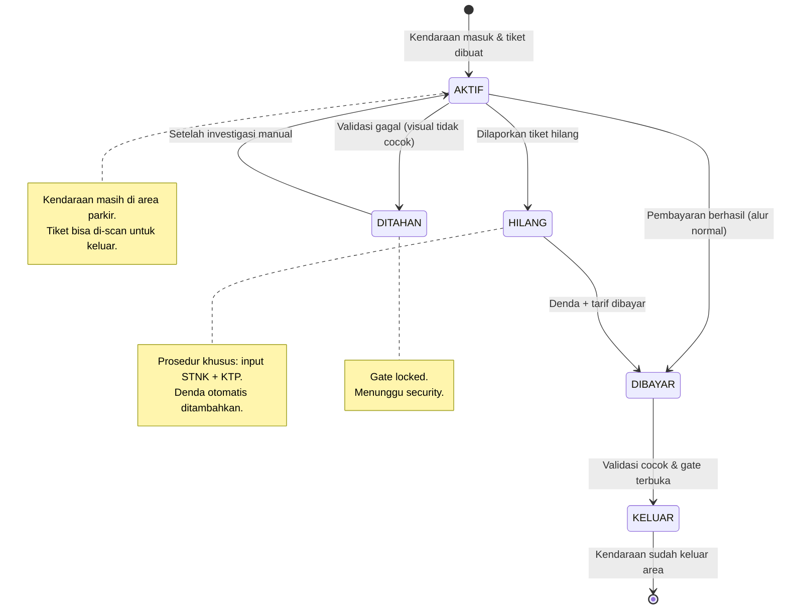

# Diagram Teknis — Sistem Parkir MKK

> **Versi**: 1.1 — Java Terminal Application
> **Mata Kuliah**: DPBO (Dasar Pemrograman Berorientasi Objek)
> **Terakhir Diperbarui**: Mei 2026
> **Referensi Elisitasi**: FR-01 s/d FR-10 (Laporan Elisitasi RKPL)

---

## Daftar Diagram

1. [Class Diagram (Utama)](#1-class-diagram-utama)
2. [Class Diagram — Model/Entity](#2-class-diagram--modelentity)
3. [Class Diagram — Service Layer](#3-class-diagram--service-layer)
4. [Class Diagram — Repository/DAO Layer](#4-class-diagram--repositorydao-layer)
5. [Class Diagram — Controller Layer](#5-class-diagram--controller-layer)
6. [Class Diagram — Utility & Observer](#6-class-diagram--utility--observer)
7. [Class Diagram — Exception Hierarchy](#7-class-diagram--exception-hierarchy)
8. [Sequence Diagram — Alur Kendaraan Keluar + Fraud Detection](#8-sequence-diagram--alur-kendaraan-keluar--fraud-detection)
9. [Sequence Diagram — Alur Tiket Hilang](#9-sequence-diagram--alur-tiket-hilang)
10. [Sequence Diagram — Alur Kendaraan Masuk + Capacity Check](#10-sequence-diagram--alur-kendaraan-masuk--capacity-check) 🆕
11. [State Diagram — Lifecycle TiketParkir](#11-state-diagram--lifecycle-tiketparkir)
12. [Activity Diagram — Proses Validasi & Pembayaran + Fraud Detection](#12-activity-diagram--proses-validasi--pembayaran--fraud-detection)

---

## 1. Class Diagram (Utama)

Diagram utama yang memuat **seluruh kelas** dan relasi antar kelas dalam sistem.

---

## 2. Class Diagram — Model/Entity

Fokus pada data domain models, collections, dan relasi pewarisan.

---

## 3. Class Diagram — Service Layer

Fokus pada business logic services, interfaces, dan concrete classes.

---

## 4. Class Diagram — Repository/DAO Layer

> **Catatan**: Repository/DAO Layer tidak didefinisikan secara eksplisit dalam diagram class arsitektur baru. Penyimpanan data saat ini dikelola dalam memori (in-memory) secara terdistribusi pada objek-objek Collection seperti `VehicleExitQueue`, `RevenueReport`, dan `DashboardMonitor`.

---

## 5. Class Diagram — Controller Layer

> **Catatan**: Controller Layer (seperti menu router CLI) diimplementasikan secara terpisah untuk memicu aksi menu interaktif terminal, yang berinteraksi langsung dengan class `User` (untuk RBAC) dan layer Service (`AuthService`, `GateController`, `LostTicketHandler`).

---

## 6. Class Diagram — Utility & Observer

> **Catatan**: Komponen utility (`DateTimeUtils`, dsb.) bertindak sebagai class pembantu dan tidak digambarkan secara eksplisit pada diagram arsitektur utama untuk menjaga fokus rancangan OOP. Pola notifikasi dan logging diimplementasikan menggunakan interface `INotifiable` yang direalisasikan oleh `Supervisor` dan `IncidentLogger`.

---

## 7. Class Diagram — Exception Hierarchy

---

## 8. Sequence Diagram — Alur Kendaraan Keluar + Fraud Detection

---

## 9. Sequence Diagram — Alur Tiket Hilang

---

## 10. Sequence Diagram — Alur Kendaraan Masuk + Capacity Check 🆕

---

## 11. State Diagram — Lifecycle TiketParkir

---

## 12. Activity Diagram — Proses Validasi & Pembayaran + Fraud Detection

---

## Ringkasan Kelas

| Layer | Jumlah Kelas | Kelas |
|-------|:------------:|-------|
| **Model/Entity** | 7 | User*, PetugasOperasional, Supervisor, StaffKeuangan, Kendaraan, TiketParkir, Transaksi |
| **Model/Log** | 2 | LogAktivitas, LogTiketHilang |
| **Model/Enum** | 7 | Role, StatusTiket, JenisKendaraan, JenisTransaksi, EventType, StatusParkiran, FraudSeverity |
| **Interface** | 4 | Reportable, TarifStrategy, EventListener, FraudRule |
| **Service** | 9 | AuthService, ParkirService, TransaksiService, TiketHilangService, LaporanService, ValidasiService, TarifService, KapasitasService, FraudDetectionService |
| **Strategy Impl** | 2 | TarifNormalStrategy, TarifTiketHilangStrategy |
| **Fraud Rule Impl** | 3 | TiketHilangFrequencyRule, DurasiAnomalRule, DuplikasiPlatRule |
| **Repository** | 5 | UserRepository, KendaraanRepository, TiketParkirRepository, TransaksiRepository, LogRepository |
| **Controller** | 4 | MenuController, PetugasMenuController, SupervisorMenuController, KeuanganMenuController |
| **Utility** | 5 | ConsoleHelper, PasswordHasher, DateTimeHelper, IdGenerator, DataMasker |
| **Validator** | 1 | InputValidator |
| **Observer** | 2 | EventManager, AktivitasLogger |
| **Factory** | 1 | UserFactory |
| **Value Object** | 1 | FraudAlert |
| **Exception** | 8 | MKKException*, AuthenticationException, InvalidCredentialsException, AccountLockedException, UnauthorizedException, ValidationException, DataNotFoundException, DuplicateDataException, InsufficientPaymentException |
| **Entry Point** | 1 | Main |
| | | |
| **TOTAL** | **~62 kelas** | |

*\* = abstract class*

> *Catatan: Penambahan ~10 kelas baru (∶19% growth) dari fitur inovasi (Smart Capacity + Fraud Detection) sesuai rekomendasi spike dan menjawab FR-06 dan FR-09 dari elisitasi.*
