# Diagram Teknis — Sistem Parkir MKK

> **Versi**: 1.1 — Java Terminal Application
> **Mata Kuliah**: DPBO (Dasar Pemrograman Berorientasi Objek)
> **Terakhir Diperbarui**: Mei 2026
> **Referensi Elisitasi**: FR-01 s/d FR-10 (Laporan Elisitasi RKPL)

---

## Daftar Diagram

1. [Class Diagram (Utama)](#1-class-diagram-utama)
2. [Class Diagram — Model/Entity](#2-class-diagram--modelentity)
3. [Class Diagram — Service Layer](#3-class-diagram--service-layer)
4. [Class Diagram — Repository/DAO Layer](#4-class-diagram--repositorydao-layer)
5. [Class Diagram — Controller Layer](#5-class-diagram--controller-layer)
6. [Class Diagram — Utility & Observer](#6-class-diagram--utility--observer)
7. [Class Diagram — Exception Hierarchy](#7-class-diagram--exception-hierarchy)
8. [Sequence Diagram — Alur Kendaraan Keluar + Fraud Detection](#8-sequence-diagram--alur-kendaraan-keluar--fraud-detection)
9. [Sequence Diagram — Alur Tiket Hilang](#9-sequence-diagram--alur-tiket-hilang)
10. [Sequence Diagram — Alur Kendaraan Masuk + Capacity Check](#10-sequence-diagram--alur-kendaraan-masuk--capacity-check) 🆕
11. [State Diagram — Lifecycle TiketParkir](#11-state-diagram--lifecycle-tiketparkir)
12. [Activity Diagram — Proses Validasi & Pembayaran + Fraud Detection](#12-activity-diagram--proses-validasi--pembayaran--fraud-detection)

---

## 1. Class Diagram (Utama)

Diagram utama yang memuat **seluruh kelas** dan relasi antar kelas dalam sistem.

```mermaid
classDiagram
    direction TB

    %% ============ ENUMS ============
    class Role {
        <<enumeration>>
        PETUGAS_OPERASIONAL
        SUPERVISOR
        STAFF_KEUANGAN
        -String deskripsi
        +getDeskripsi() String
    }

    class StatusTiket {
        <<enumeration>>
        AKTIF
        DIBAYAR
        KELUAR
        HILANG
    }

    class JenisKendaraan {
        <<enumeration>>
        MOTOR
        MOBIL
        -double tarifPerJam
        +getTarifPerJam() double
    }

    class JenisTransaksi {
        <<enumeration>>
        NORMAL
        TIKET_HILANG
    }

    class EventType {
        <<enumeration>>
        USER_LOGIN
        USER_LOGOUT
        KENDARAAN_MASUK
        KENDARAAN_KELUAR
        PEMBAYARAN
        TIKET_HILANG
        VALIDASI_GAGAL
        USER_CREATED
        USER_DELETED
        FLAG_SUSPICIOUS
        REKONSILIASI
        FRAUD_DETECTED
        KAPASITAS_PENUH
    }

    class StatusParkiran {
        <<enumeration>>
        LANCAR
        RAMAI
        HAMPIR_PENUH
        PENUH
        -String label
        -int batasMinPersen
        -int batasMaksPersen
        +getLabel() String
        +fromOkupansi(int persen)$ StatusParkiran
    }

    class FraudSeverity {
        <<enumeration>>
        LOW
        MEDIUM
        HIGH
        -String deskripsi
        +getDeskripsi() String
    }

    %% ============ INTERFACES ============
    class Reportable {
        <<interface>>
        +generateLaporan() String
        +getHeaders() String[]
    }

    class TarifStrategy {
        <<interface>>
        +hitungTarif(TiketParkir tiket) double
        +getNamaStrategy() String
    }

    class EventListener {
        <<interface>>
        +onEvent(EventType type, Object data) void
    }

    class FraudRule {
        <<interface>>
        +evaluate(Transaksi transaksi, User petugas) FraudAlert
        +getRuleName() String
    }

    %% ============ ABSTRACT CLASSES ============
    class User {
        <<abstract>>
        -String userId
        -String nama
        -String username
        -String passwordHash
        -Role role
        -boolean aktif
        -LocalDateTime createdAt
        +User(String userId, String nama, String username, String passwordHash, Role role)
        +getUserId() String
        +getNama() String
        +setNama(String nama) void
        +getUsername() String
        +getPasswordHash() String
        +setPasswordHash(String passwordHash) void
        +getRole() Role
        +isAktif() boolean
        +setAktif(boolean aktif) void
        +getCreatedAt() LocalDateTime
        +tampilkanMenu()* void
    }

    %% ============ USER SUBCLASSES ============
    class PetugasOperasional {
        +PetugasOperasional(String userId, String nama, String username, String passwordHash)
        +tampilkanMenu() void
    }

    class Supervisor {
        +Supervisor(String userId, String nama, String username, String passwordHash)
        +tampilkanMenu() void
    }

    class StaffKeuangan {
        +StaffKeuangan(String userId, String nama, String username, String passwordHash)
        +tampilkanMenu() void
    }

    %% ============ MODEL CLASSES ============
    class Kendaraan {
        -String kendaraanId
        -String platNomor
        -JenisKendaraan jenis
        -String deskripsiVisual
        -LocalDateTime waktuMasuk
        +Kendaraan(String kendaraanId, String platNomor, JenisKendaraan jenis, String deskripsiVisual)
        +getKendaraanId() String
        +getPlatNomor() String
        +getJenis() JenisKendaraan
        +getDeskripsiVisual() String
        +getWaktuMasuk() LocalDateTime
    }

    class TiketParkir {
        -String kodeTiket
        -Kendaraan kendaraan
        -User petugasMasuk
        -User petugasKeluar
        -LocalDateTime waktuMasuk
        -LocalDateTime waktuKeluar
        -StatusTiket status
        -double tarifTotal
        +TiketParkir(String kodeTiket, Kendaraan kendaraan, User petugasMasuk)
        +getKodeTiket() String
        +getKendaraan() Kendaraan
        +getPetugasMasuk() User
        +getPetugasKeluar() User
        +setPetugasKeluar(User petugasKeluar) void
        +getWaktuMasuk() LocalDateTime
        +getWaktuKeluar() LocalDateTime
        +setWaktuKeluar(LocalDateTime waktuKeluar) void
        +getStatus() StatusTiket
        +setStatus(StatusTiket status) void
        +getTarifTotal() double
        +setTarifTotal(double tarifTotal) void
        +getDurasiJam() long
    }

    class Transaksi {
        -String transaksiId
        -TiketParkir tiketParkir
        -User petugas
        -JenisTransaksi jenis
        -double totalBayar
        -double uangDiterima
        -double kembalian
        -LocalDateTime waktuTransaksi
        +Transaksi(String transaksiId, TiketParkir tiketParkir, User petugas, JenisTransaksi jenis, double totalBayar, double uangDiterima)
        +getTransaksiId() String
        +getTiketParkir() TiketParkir
        +getPetugas() User
        +getJenis() JenisTransaksi
        +getTotalBayar() double
        +getUangDiterima() double
        +getKembalian() double
        +getWaktuTransaksi() LocalDateTime
    }

    class LogAktivitas {
        -String logId
        -String userId
        -String aksi
        -String detail
        -LocalDateTime waktu
        -boolean flagSuspicious
        -String flaggedBy
        +LogAktivitas(String logId, String userId, String aksi, String detail)
        +getLogId() String
        +getUserId() String
        +getAksi() String
        +getDetail() String
        +getWaktu() LocalDateTime
        +isFlagSuspicious() boolean
        +setFlagSuspicious(boolean flag, String flaggedBy) void
        +getFlaggedBy() String
    }

    class LogTiketHilang {
        -String logId
        -String kodeTiket
        -String petugasId
        -String platNomor
        -String nomorSTNK
        -String nomorKTP
        -double dendaTiketHilang
        -double tarifParkir
        -double totalBayar
        -LocalDateTime waktuLapor
        +LogTiketHilang(String logId, String kodeTiket, String petugasId, String platNomor, String nomorSTNK, String nomorKTP, double denda, double tarif, double total)
        +getKodeTiket() String
        +getPetugasId() String
        +getPlatNomor() String
        +getNomorSTNK() String
        +getNomorKTP() String
        +getDendaTiketHilang() double
        +getTarifParkir() double
        +getTotalBayar() double
        +getWaktuLapor() LocalDateTime
        +getMaskedSTNK() String
        +getMaskedKTP() String
    }

    %% ============ REPOSITORY CLASSES ============
    class UserRepository {
        -List~User~ users
        -Map~String, User~ usernameIndex
        +save(User) void
        +findByUsername(String) User
        +findAll() List~User~
        +delete(String) boolean
        +existsByUsername(String) boolean
        +count() int
    }

    class KendaraanRepository {
        -List~Kendaraan~ kendaraans
        -Map~String, Kendaraan~ platIndex
        +save(Kendaraan) void
        +findByPlatNomor(String) Kendaraan
        +findAll() List~Kendaraan~
        +count() int
    }

    class TiketParkirRepository {
        -List~TiketParkir~ tikets
        -Map~String, TiketParkir~ kodeTiketIndex
        +save(TiketParkir) void
        +findByKodeTiket(String) TiketParkir
        +findActiveByPlatNomor(String) TiketParkir
        +findAllActive() List~TiketParkir~
        +update(TiketParkir) void
        +countActive() int
        +countByDate(LocalDate) int
    }

    class TransaksiRepository {
        -List~Transaksi~ transaksis
        +save(Transaksi) void
        +findByTanggal(LocalDate) List~Transaksi~
        +findAll() List~Transaksi~
        +getTotalPendapatan(LocalDate) double
        +countByDate(LocalDate) int
    }

    class LogRepository {
        -List~LogAktivitas~ logs
        -List~LogTiketHilang~ logsTiketHilang
        +saveLog(LogAktivitas) void
        +saveLogTiketHilang(LogTiketHilang) void
        +findAllLogs() List~LogAktivitas~
        +findLogsByAksi(String) List~LogAktivitas~
        +findSuspiciousLogs() List~LogAktivitas~
        +findAllLogsTiketHilang() List~LogTiketHilang~
        +countTiketHilangByDate(LocalDate) int
    }

    %% ============ SERVICE CLASSES ============
    class AuthService {
        -AuthService instance$
        -User currentUser
        -LocalDateTime loginTime
        -Map~String, Integer~ failedAttempts
        -UserRepository userRepository
        -EventManager eventManager
        -AuthService()
        +getInstance()$ AuthService
        +login(String, String) User
        +logout() void
        +getCurrentUser() User
        +isLoggedIn() boolean
        +changePassword(String, String) void
    }

    class ParkirService {
        -KendaraanRepository kendaraanRepo
        -TiketParkirRepository tiketRepo
        -TarifService tarifService
        -ValidasiService validasiService
        -EventManager eventManager
        +registrasiMasuk(User, String, JenisKendaraan, String) TiketParkir
        +prosesKeluar(User, String) TiketParkir
        +getKendaraanAktif() List~TiketParkir~
    }

    class TransaksiService {
        -TransaksiRepository transaksiRepo
        -TiketParkirRepository tiketRepo
        -EventManager eventManager
        +prosesTransaksi(User, TiketParkir, double, JenisTransaksi) Transaksi
        +getTransaksiHariIni() List~Transaksi~
    }

    class TiketHilangService {
        -TiketParkirRepository tiketRepo
        -KendaraanRepository kendaraanRepo
        -LogRepository logRepo
        -TarifService tarifService
        -EventManager eventManager
        +prosesTiketHilang(User, String, String, String) TiketParkir
    }

    class LaporanService {
        -TransaksiRepository transaksiRepo
        -LogRepository logRepo
        -TiketParkirRepository tiketRepo
        +laporanHarian(LocalDate) String
        +laporanPerShift(LocalDate, int) String
        +detailTransaksi(LocalDate) List~Transaksi~
        +laporanTiketHilang(LocalDate) List~LogTiketHilang~
        +rekonsiliasi(LocalDate, double) Map~String, Object~
    }

    class ValidasiService {
        +validasiVisual(String deskripsiMasuk) boolean
    }

    class TarifService {
        -TarifStrategy currentStrategy
        +setStrategy(TarifStrategy) void
        +hitungTarif(TiketParkir) double
    }

    class KapasitasService {
        -TiketParkirRepository tiketRepo
        -int maksKapasitas
        +KapasitasService(TiketParkirRepository tiketRepo, int maksKapasitas)
        +getOkupansiSaatIni() int
        +getPersentaseOkupansi() int
        +getStatus() StatusParkiran
        +isBolehMasuk() boolean
    }

    class FraudDetectionService {
        -List~FraudRule~ rules
        -LogRepository logRepo
        -EventManager eventManager
        +FraudDetectionService(LogRepository logRepo, EventManager eventManager)
        +addRule(FraudRule rule) void
        +analyze(Transaksi transaksi, User petugas) List~FraudAlert~
    }

    class FraudAlert {
        <<value object>>
        -String alertId
        -String ruleName
        -String petugasId
        -String detail
        -FraudSeverity severity
        -LocalDateTime waktuDeteksi
        -boolean ditindaklanjuti
        +FraudAlert(String alertId, String ruleName, String petugasId, String detail, FraudSeverity severity)
        +getAlertId() String
        +getRuleName() String
        +getPetugasId() String
        +getDetail() String
        +getSeverity() FraudSeverity
        +getWaktuDeteksi() LocalDateTime
        +isDitindaklanjuti() boolean
        +setDitindaklanjuti(boolean ditindaklanjuti) void
    }

    %% ============ STRATEGY IMPLEMENTATIONS ============
    class TarifNormalStrategy {
        +hitungTarif(TiketParkir) double
        +getNamaStrategy() String
    }

    class TarifTiketHilangStrategy {
        -double DENDA_TIKET_HILANG$
        +hitungTarif(TiketParkir) double
        +getNamaStrategy() String
    }

    %% ============ FRAUD RULE IMPLEMENTATIONS ============
    class TiketHilangFrequencyRule {
        -LogRepository logRepo
        -int threshold
        +evaluate(Transaksi, User) FraudAlert
        +getRuleName() String
    }

    class DurasiAnomalRule {
        -int minDurasiMenit
        +evaluate(Transaksi, User) FraudAlert
        +getRuleName() String
    }

    class DuplikasiPlatRule {
        -TiketParkirRepository tiketRepo
        +evaluate(Transaksi, User) FraudAlert
        +getRuleName() String
    }

    %% ============ CONTROLLER CLASSES ============
    class Main {
        +main(String[]) void$
        -initDummyData() void$
    }

    class MenuController {
        -AuthService authService
        -Scanner scanner
        +start() void
        +tampilkanLogin() void
        +rutekanMenu(User) void
    }

    class PetugasMenuController {
        -User user
        -ParkirService parkirService
        -TransaksiService transaksiService
        -TiketHilangService tiketHilangService
        -Scanner scanner
        +start() void
        -menuRegistrasiMasuk() void
        -menuProsesKeluar() void
        -menuTiketHilang() void
        -menuGantiPassword() void
    }

    class SupervisorMenuController {
        -User user
        -LaporanService laporanService
        -UserRepository userRepository
        -LogRepository logRepository
        -Scanner scanner
        +start() void
        -menuDashboard() void
        -menuLogAktivitas() void
        -menuManajemenUser() void
        -menuKinerjaPetugas() void
    }

    class KeuanganMenuController {
        -User user
        -LaporanService laporanService
        -Scanner scanner
        +start() void
        -menuLaporanHarian() void
        -menuDetailTransaksi() void
        -menuLaporanTiketHilang() void
        -menuRekonsiliasi() void
    }

    %% ============ UTILITY CLASSES ============
    class ConsoleHelper {
        +printHeader(String) void$
        +printMenu(String[]) void$
        +printTable(String[], List~String[]~) void$
        +printBox(String) void$
        +printSuccess(String) void$
        +printError(String) void$
        +printWarning(String) void$
        +printAlert(String) void$
        +clearScreen() void$
        +pressEnter(Scanner) void$
        +formatRupiah(double) String$
    }

    class PasswordHasher {
        +hash(String) String$
        +verify(String, String) boolean$
    }

    class DateTimeHelper {
        +formatDateTime(LocalDateTime) String$
        +formatDate(LocalDate) String$
        +hitungDurasiJam(LocalDateTime, LocalDateTime) long$
        +formatDurasi(long) String$
        +now() LocalDateTime$
        +today() LocalDate$
    }

    class IdGenerator {
        -int tiketCounter$
        -int transaksiCounter$
        -int logCounter$
        -int userCounter$
        -int kendaraanCounter$
        +generateTiketId() String$
        +generateTransaksiId() String$
        +generateLogId() String$
        +generateUserId() String$
        +generateKendaraanId() String$
    }

    class DataMasker {
        +maskKTP(String) String$
        +maskSTNK(String) String$
        +maskPassword(int) String$
    }

    class InputValidator {
        +validatePlatNomor(String) String$
        +validateKTP(String) String$
        +validateSTNK(String) String$
        +validateMenuChoice(String, int, int) int$
        +validateUang(String) double$
        +validateUsername(String) String$
        +validatePassword(String) String$
    }

    %% ============ OBSERVER CLASSES ============
    class EventManager {
        -Map~EventType, List~EventListener~~ listeners
        +subscribe(EventType, EventListener) void
        +unsubscribe(EventType, EventListener) void
        +notify(EventType, Object) void
    }

    class AktivitasLogger {
        -LogRepository logRepository
        +onEvent(EventType, Object) void
    }

    %% ============ FACTORY ============
    class UserFactory {
        +createUser(String, String, String, Role) User$
    }

    %% ============ RELASI ============

    %% Inheritance (User hierarchy)
    User <|-- PetugasOperasional
    User <|-- Supervisor
    User <|-- StaffKeuangan

    %% Inheritance (Log)
    LogAktivitas <|-- LogTiketHilang

    %% Interface Implementation
    TarifStrategy <|.. TarifNormalStrategy
    TarifStrategy <|.. TarifTiketHilangStrategy
    EventListener <|.. AktivitasLogger
    Reportable <|.. LaporanService

    %% Composition (strong ownership)
    TiketParkir *-- Kendaraan : contains

    %% Association
    TiketParkir --> User : petugasMasuk
    TiketParkir --> User : petugasKeluar
    Transaksi --> TiketParkir : references
    Transaksi --> User : petugas

    %% Dependency (uses)
    User --> Role : has
    Kendaraan --> JenisKendaraan : has
    TiketParkir --> StatusTiket : has
    Transaksi --> JenisTransaksi : has

    %% Service dependencies
    AuthService --> UserRepository : uses
    AuthService --> EventManager : uses
    ParkirService --> KendaraanRepository : uses
    ParkirService --> TiketParkirRepository : uses
    ParkirService --> TarifService : uses
    ParkirService --> ValidasiService : uses
    ParkirService --> EventManager : uses
    TransaksiService --> TransaksiRepository : uses
    TransaksiService --> EventManager : uses
    TiketHilangService --> TiketParkirRepository : uses
    TiketHilangService --> KendaraanRepository : uses
    TiketHilangService --> LogRepository : uses
    TiketHilangService --> TarifService : uses
    TiketHilangService --> EventManager : uses
    LaporanService --> TransaksiRepository : uses
    LaporanService --> LogRepository : uses
    TarifService --> TarifStrategy : delegates

    %% Controller dependencies
    MenuController --> AuthService : uses
    PetugasMenuController --> ParkirService : uses
    PetugasMenuController --> TransaksiService : uses
    PetugasMenuController --> TiketHilangService : uses
    SupervisorMenuController --> LaporanService : uses
    SupervisorMenuController --> UserRepository : uses
    SupervisorMenuController --> LogRepository : uses
    KeuanganMenuController --> LaporanService : uses

    %% Observer
    EventManager --> EventListener : notifies
    AktivitasLogger --> LogRepository : uses

    %% Factory
    UserFactory ..> User : creates
    UserFactory --> Role : uses

    %% Main
    Main --> MenuController : creates

    %% Capacity & Fraud (fitur inovasi)
    KapasitasService --> TiketParkirRepository : uses
    KapasitasService --> StatusParkiran : returns
    ParkirService --> KapasitasService : checks before entry
    FraudDetectionService --> FraudRule : iterates
    FraudDetectionService --> LogRepository : saves alerts
    FraudDetectionService --> EventManager : notifies
    FraudRule <|.. TiketHilangFrequencyRule
    FraudRule <|.. DurasiAnomalRule
    FraudRule <|.. DuplikasiPlatRule
    TiketHilangFrequencyRule --> LogRepository : queries
    DuplikasiPlatRule --> TiketParkirRepository : queries
    FraudAlert --> FraudSeverity : has
    ParkirService --> FraudDetectionService : analyzes post-transaction
```

---

## 2. Class Diagram — Model/Entity

Fokus pada entity domain dan relasinya.

```mermaid
classDiagram
    direction LR

    class User {
        <<abstract>>
        -String userId
        -String nama
        -String username
        -String passwordHash
        -Role role
        -boolean aktif
        -LocalDateTime createdAt
        +User(String userId, String nama, String username, String passwordHash, Role role)
        +getUserId() String
        +getNama() String
        +setNama(String nama) void
        +getUsername() String
        +getPasswordHash() String
        +setPasswordHash(String passwordHash) void
        +getRole() Role
        +isAktif() boolean
        +setAktif(boolean aktif) void
        +getCreatedAt() LocalDateTime
        +tampilkanMenu()* void
    }

    class PetugasOperasional {
        +PetugasOperasional(String userId, String nama, String username, String passwordHash)
        +tampilkanMenu() void
    }

    class Supervisor {
        +Supervisor(String userId, String nama, String username, String passwordHash)
        +tampilkanMenu() void
    }

    class StaffKeuangan {
        +StaffKeuangan(String userId, String nama, String username, String passwordHash)
        +tampilkanMenu() void
    }

    class Kendaraan {
        -String kendaraanId
        -String platNomor
        -JenisKendaraan jenis
        -String deskripsiVisual
        -LocalDateTime waktuMasuk
        +Kendaraan(String kendaraanId, String platNomor, JenisKendaraan jenis, String deskripsiVisual)
        +getKendaraanId() String
        +getPlatNomor() String
        +getJenis() JenisKendaraan
        +getDeskripsiVisual() String
        +getWaktuMasuk() LocalDateTime
    }

    class TiketParkir {
        -String kodeTiket
        -Kendaraan kendaraan
        -User petugasMasuk
        -User petugasKeluar
        -LocalDateTime waktuMasuk
        -LocalDateTime waktuKeluar
        -StatusTiket status
        -double tarifTotal
        +TiketParkir(String kodeTiket, Kendaraan kendaraan, User petugasMasuk)
        +getKodeTiket() String
        +getKendaraan() Kendaraan
        +getPetugasMasuk() User
        +getPetugasKeluar() User
        +setPetugasKeluar(User petugasKeluar) void
        +getWaktuMasuk() LocalDateTime
        +getWaktuKeluar() LocalDateTime
        +setWaktuKeluar(LocalDateTime waktuKeluar) void
        +getStatus() StatusTiket
        +setStatus(StatusTiket status) void
        +getTarifTotal() double
        +setTarifTotal(double tarifTotal) void
        +getDurasiJam() long
    }

    class Transaksi {
        -String transaksiId
        -TiketParkir tiketParkir
        -User petugas
        -JenisTransaksi jenis
        -double totalBayar
        -double uangDiterima
        -double kembalian
        -LocalDateTime waktuTransaksi
        +Transaksi(String transaksiId, TiketParkir tiketParkir, User petugas, JenisTransaksi jenis, double totalBayar, double uangDiterima)
        +getTransaksiId() String
        +getTiketParkir() TiketParkir
        +getPetugas() User
        +getJenis() JenisTransaksi
        +getTotalBayar() double
        +getUangDiterima() double
        +getKembalian() double
        +getWaktuTransaksi() LocalDateTime
    }

    class LogAktivitas {
        -String logId
        -String userId
        -String aksi
        -String detail
        -LocalDateTime waktu
        -boolean flagSuspicious
        -String flaggedBy
        +LogAktivitas(String logId, String userId, String aksi, String detail)
        +getLogId() String
        +getUserId() String
        +getAksi() String
        +getDetail() String
        +getWaktu() LocalDateTime
        +isFlagSuspicious() boolean
        +setFlagSuspicious(boolean flag, String flaggedBy) void
        +getFlaggedBy() String
    }

    class LogTiketHilang {
        -String logId
        -String kodeTiket
        -String petugasId
        -String platNomor
        -String nomorSTNK
        -String nomorKTP
        -double dendaTiketHilang
        -double tarifParkir
        -double totalBayar
        -LocalDateTime waktuLapor
        +LogTiketHilang(String logId, String kodeTiket, String petugasId, String platNomor, String nomorSTNK, String nomorKTP, double denda, double tarif, double total)
        +getKodeTiket() String
        +getPetugasId() String
        +getPlatNomor() String
        +getNomorSTNK() String
        +getNomorKTP() String
        +getDendaTiketHilang() double
        +getTarifParkir() double
        +getTotalBayar() double
        +getWaktuLapor() LocalDateTime
        +getMaskedSTNK() String
        +getMaskedKTP() String
    }

    User <|-- PetugasOperasional
    User <|-- Supervisor
    User <|-- StaffKeuangan
    LogAktivitas <|-- LogTiketHilang

    TiketParkir *-- "1" Kendaraan
    TiketParkir --> "1" User : petugasMasuk
    TiketParkir --> "0..1" User : petugasKeluar
    Transaksi --> "1" TiketParkir
    Transaksi --> "1" User : petugas
```

---

## 3. Class Diagram — Service Layer

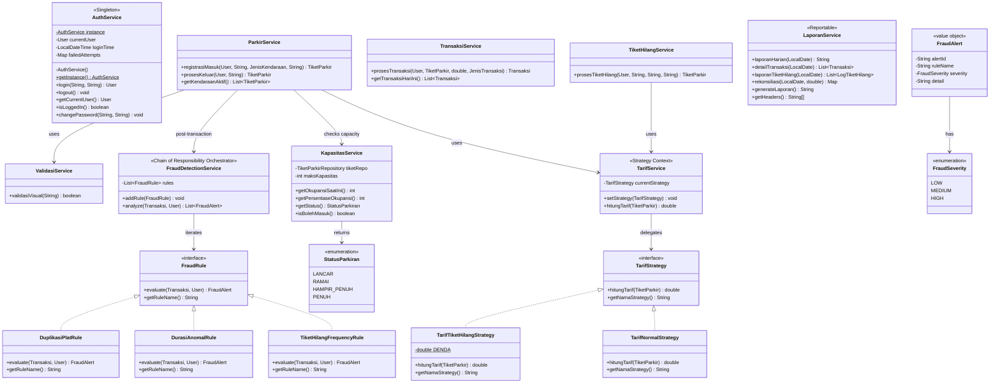

---

## 4. Class Diagram — Repository/DAO Layer

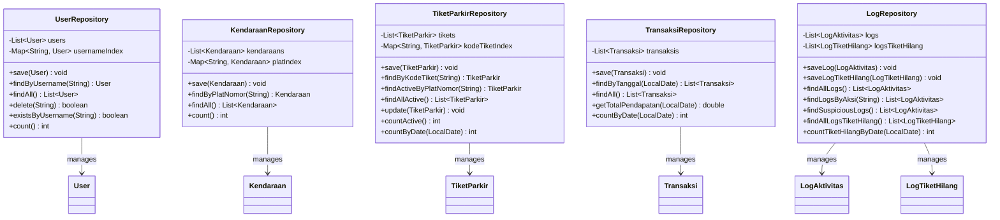

---

## 5. Class Diagram — Controller Layer

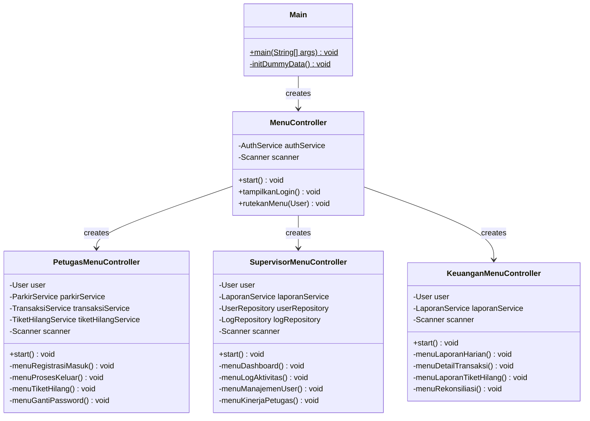

---

## 6. Class Diagram — Utility & Observer

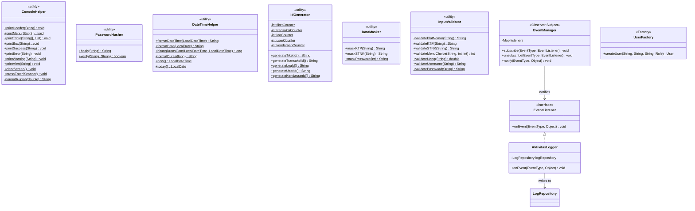

---

## 7. Class Diagram — Exception Hierarchy

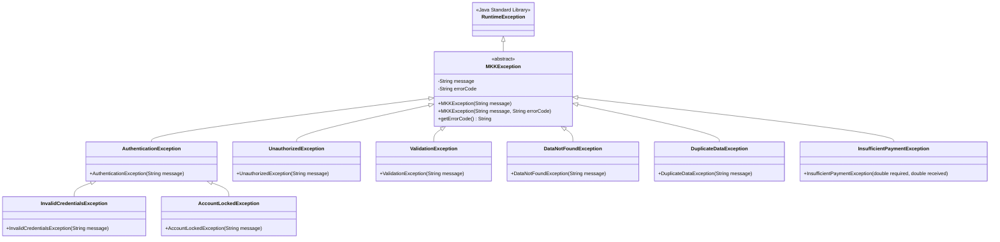

---

## 8. Sequence Diagram — Alur Kendaraan Keluar + Fraud Detection

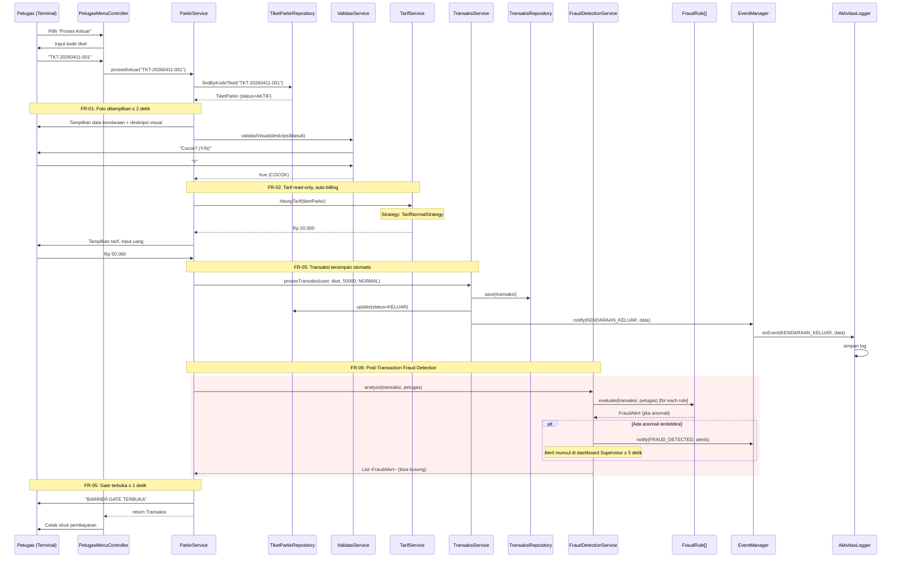

---

## 9. Sequence Diagram — Alur Tiket Hilang

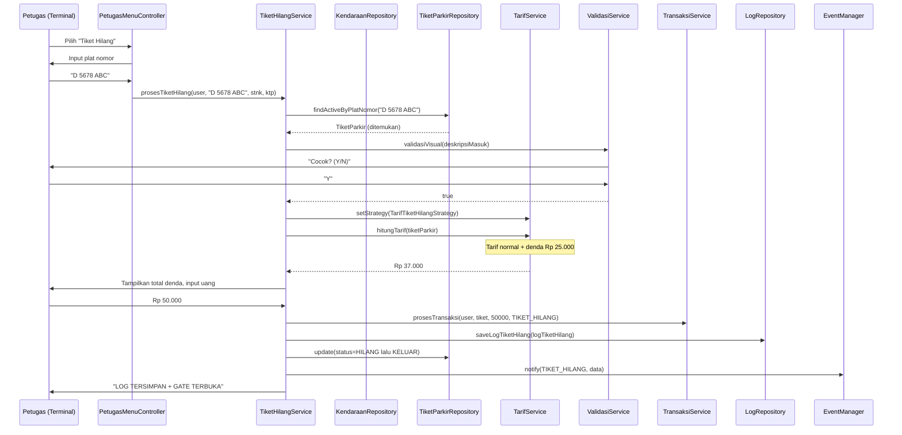

---

## 10. Sequence Diagram — Alur Kendaraan Masuk + Capacity Check 🆕

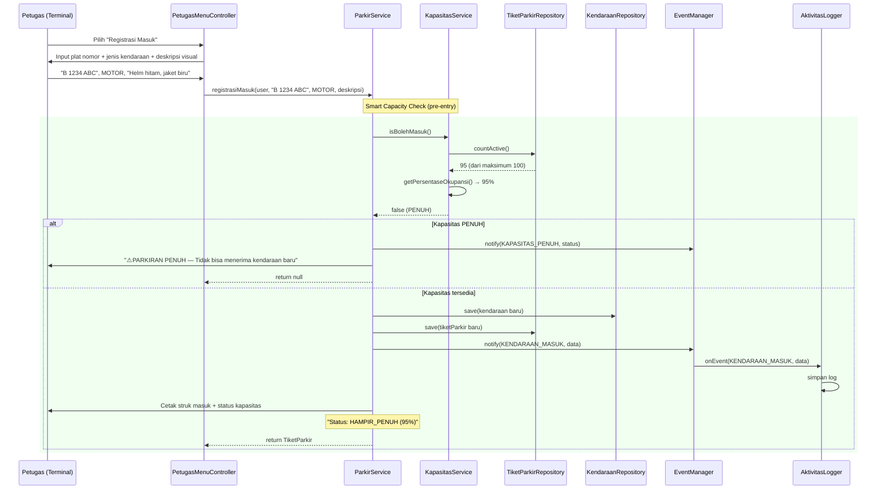

---

## 11. State Diagram — Lifecycle TiketParkir

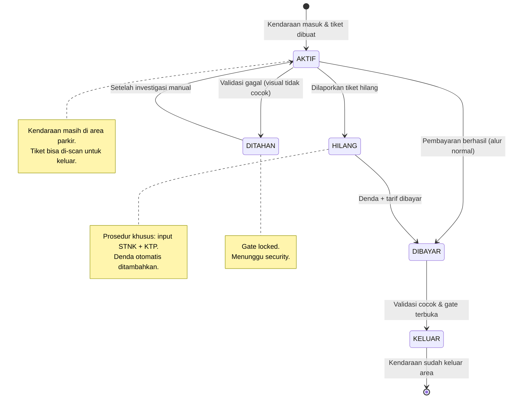

---

## 12. Activity Diagram — Proses Validasi & Pembayaran + Fraud Detection

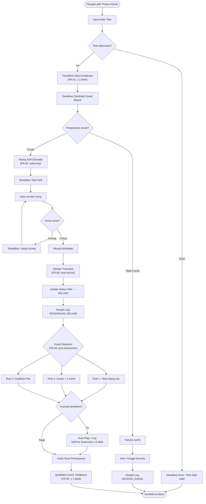

---

## Ringkasan Kelas

| Layer | Jumlah Kelas | Kelas |
|-------|:------------:|-------|
| **Model/Entity** | 7 | User*, PetugasOperasional, Supervisor, StaffKeuangan, Kendaraan, TiketParkir, Transaksi |
| **Model/Log** | 2 | LogAktivitas, LogTiketHilang |
| **Model/Enum** | 7 | Role, StatusTiket, JenisKendaraan, JenisTransaksi, EventType, StatusParkiran, FraudSeverity |
| **Interface** | 4 | Reportable, TarifStrategy, EventListener, FraudRule |
| **Service** | 9 | AuthService, ParkirService, TransaksiService, TiketHilangService, LaporanService, ValidasiService, TarifService, KapasitasService, FraudDetectionService |
| **Strategy Impl** | 2 | TarifNormalStrategy, TarifTiketHilangStrategy |
| **Fraud Rule Impl** | 3 | TiketHilangFrequencyRule, DurasiAnomalRule, DuplikasiPlatRule |
| **Repository** | 5 | UserRepository, KendaraanRepository, TiketParkirRepository, TransaksiRepository, LogRepository |
| **Controller** | 4 | MenuController, PetugasMenuController, SupervisorMenuController, KeuanganMenuController |
| **Utility** | 5 | ConsoleHelper, PasswordHasher, DateTimeHelper, IdGenerator, DataMasker |
| **Validator** | 1 | InputValidator |
| **Observer** | 2 | EventManager, AktivitasLogger |
| **Factory** | 1 | UserFactory |
| **Value Object** | 1 | FraudAlert |
| **Exception** | 8 | MKKException*, AuthenticationException, InvalidCredentialsException, AccountLockedException, UnauthorizedException, ValidationException, DataNotFoundException, DuplicateDataException, InsufficientPaymentException |
| **Entry Point** | 1 | Main |
| | | |
| **TOTAL** | **~62 kelas** | |

*\* = abstract class*

> *Catatan: Penambahan ~10 kelas baru (∶19% growth) dari fitur inovasi (Smart Capacity + Fraud Detection) sesuai rekomendasi spike dan menjawab FR-06 dan FR-09 dari elisitasi.*
