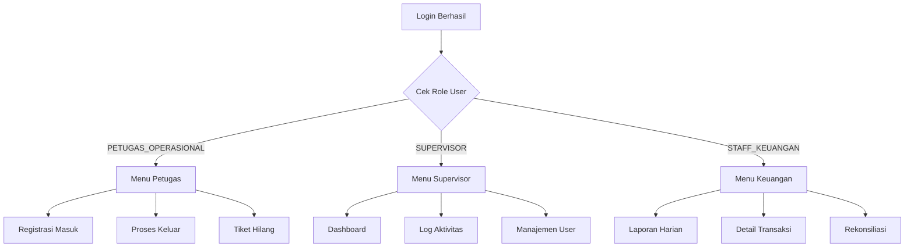
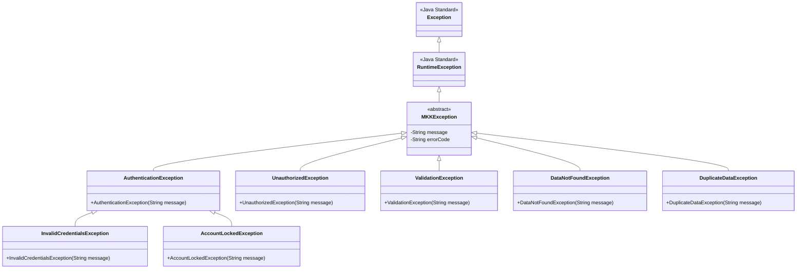

# Keamanan & Privasi — Sistem Parkir MKK

> **Versi**: 1.0 — Java Terminal Application
> **Mata Kuliah**: DPBO (Dasar Pemrograman Berorientasi Objek)
> **Terakhir Diperbarui**: April 2026

---

## Ringkasan

Dokumen ini menjelaskan aspek keamanan dan privasi data pada Sistem Parkir MKK versi Java terminal. Meskipun ini adalah aplikasi akademik, prinsip-prinsip keamanan tetap diterapkan untuk menunjukkan pemahaman best practice pengembangan perangkat lunak yang aman.

---

## 1. Autentikasi (Authentication)

### 1.1 Mekanisme Login

Setiap pengguna harus login sebelum dapat mengakses fitur sistem.

```
┌──────────────────────────────────────────────────┐
│                ALUR AUTENTIKASI                  │
├──────────────────────────────────────────────────┤
│                                                  │
│  Input username ──→ Cari di UserRepository       │
│       │                    │                     │
│       │              User tidak ada?             │
│       │              ──→ "Username tidak valid"  │
│       │                                          │
│  Input password ──→ Hash password input          │
│       │                    │                     │
│       │              Bandingkan hash             │
│       │              ──→ Cocok: Login sukses     │
│       │              ──→ Tidak: "Password salah" │
│       │                                          │
│  Catat login ke LogAktivitas                     │
│  Set currentUser di AuthService                  │
│                                                  │
└──────────────────────────────────────────────────┘
```

### 1.2 Password Hashing

Password **tidak pernah** disimpan dalam bentuk plaintext. Sistem menggunakan simple hashing untuk demo.

```java
public class PasswordHasher {

    /**
     * Hash password menggunakan SHA-256.
     * Catatan: Untuk produksi, gunakan BCrypt/Argon2.
     */
    public static String hash(String password) {
        MessageDigest md = MessageDigest.getInstance("SHA-256");
        byte[] hashBytes = md.digest(password.getBytes(StandardCharsets.UTF_8));
        StringBuilder sb = new StringBuilder();
        for (byte b : hashBytes) {
            sb.append(String.format("%02x", b));
        }
        return sb.toString();
    }

    public static boolean verify(String password, String storedHash) {
        return hash(password).equals(storedHash);
    }
}
```

| Aspek | Implementasi | Catatan Produksi |
|-------|-------------|-----------------|
| Algoritma hash | SHA-256 (demonstrasi) | Gunakan BCrypt/Argon2id |
| Salt | Tidak (simpel) | Wajib pakai random salt |
| Penyimpanan | In-memory (atribut private) | Database terenkripsi |

### 1.3 Mekanisme Brute-Force Protection

```java
// Di AuthService
private static final int MAX_LOGIN_ATTEMPTS = 3;
private final Map<String, Integer> failedAttempts = new HashMap<>();

public User login(String username, String password) {
    // Cek apakah akun sudah terkunci
    if (failedAttempts.getOrDefault(username, 0) >= MAX_LOGIN_ATTEMPTS) {
        throw new AccountLockedException(
            "Akun terkunci. Hubungi Supervisor."
        );
    }

    User user = userRepository.findByUsername(username);
    if (user == null || !PasswordHasher.verify(password, user.getPasswordHash())) {
        failedAttempts.merge(username, 1, Integer::sum);
        int remaining = MAX_LOGIN_ATTEMPTS - failedAttempts.get(username);
        throw new InvalidCredentialsException(
            "Login gagal. Sisa percobaan: " + remaining
        );
    }

    // Reset counter jika berhasil
    failedAttempts.remove(username);
    return user;
}
```

---

## 2. Otorisasi (Authorization)

### 2.1 Role-Based Access Control (RBAC)

Sistem menerapkan kontrol akses berbasis peran. Setiap role hanya bisa mengakses menu yang sesuai.



### 2.2 Matriks Akses

| Fitur | Petugas Operasional | Supervisor | Staff Keuangan |
|-------|:-------------------:|:----------:|:--------------:|
| Login/Logout | ✅ | ✅ | ✅ |
| Ganti Password Sendiri | ✅ | ✅ | ✅ |
| Registrasi Kendaraan Masuk | ✅ | ❌ | ❌ |
| Proses Kendaraan Keluar | ✅ | ❌ | ❌ |
| Penanganan Tiket Hilang | ✅ | ❌ | ❌ |
| Dashboard Statistik | ❌ | ✅ | ❌ |
| Log Aktivitas | ❌ | ✅ | ❌ |
| Manajemen Pengguna | ❌ | ✅ | ❌ |
| Kinerja Petugas | ❌ | ✅ | ❌ |
| Flag Suspicious | ❌ | ✅ | ❌ |
| Laporan Pendapatan | ❌ | ❌ | ✅ |
| Detail Transaksi | ❌ | ❌ | ✅ |
| Laporan Tiket Hilang | ❌ | ❌ | ✅ |
| Rekonsiliasi Kas | ❌ | ❌ | ✅ |

### 2.3 Implementasi RBAC di Controller

```java
public class MenuController {
    public void tampilkanMenu(User user) {
        switch (user.getRole()) {
            case PETUGAS_OPERASIONAL ->
                new PetugasMenuController(user).start();
            case SUPERVISOR ->
                new SupervisorMenuController(user).start();
            case STAFF_KEUANGAN ->
                new KeuanganMenuController(user).start();
        }
    }
}
```

**Keamanan tambahan**: Setiap controller menerima `User` yang sudah ter-autentikasi, dan method di service layer melakukan **double-check** role jika diperlukan:

```java
public class ParkirService {
    public TiketParkir registrasiMasuk(User petugas, String platNomor, ...) {
        // Double-check authorization
        if (petugas.getRole() != Role.PETUGAS_OPERASIONAL) {
            throw new UnauthorizedException("Hanya Petugas yang bisa registrasi.");
        }
        // ... proses registrasi
    }
}
```

---

## 3. Privasi Data (Data Privacy)

### 3.1 Data Sensitif

Sistem menyimpan beberapa data sensitif yang perlu perlindungan khusus:

| Data | Tingkat Sensitivitas | Penanganan |
|------|---------------------|------------|
| Password | 🔴 Tinggi | Disimpan sebagai hash, tidak pernah plaintext |
| Nomor KTP | 🔴 Tinggi | Disimpan private, ditampilkan partial (mask) |
| Nomor STNK | 🟡 Sedang | Disimpan private, ditampilkan partial (mask) |
| Deskripsi Visual | 🟡 Sedang | Hanya diakses saat proses validasi keluar |
| Plat Nomor | 🟢 Rendah | Data publik kendaraan |

### 3.2 Data Masking

Data sensitif di-mask saat ditampilkan di terminal:

```java
public class DataMasker {

    /**
     * Mask nomor KTP: 3201234567890001 → 320123456789****
     */
    public static String maskKTP(String ktp) {
        if (ktp.length() <= 4) return "****";
        return ktp.substring(0, ktp.length() - 4) + "****";
    }

    /**
     * Mask nomor STNK: 12345678901234 → 1234567890****
     */
    public static String maskSTNK(String stnk) {
        if (stnk.length() <= 4) return "****";
        return stnk.substring(0, stnk.length() - 4) + "****";
    }

    /**
     * Mask password saat input: setiap karakter jadi *
     */
    public static String maskPassword(int length) {
        return "*".repeat(length);
    }
}
```

### 3.3 Prinsip Minimal Akses Data

- **Petugas Operasional**: Hanya melihat data yang diperlukan untuk transaksi saat ini
- **Supervisor**: Melihat log aktivitas dan statistik, **tidak** bisa melihat detail KTP/STNK lengkap
- **Staff Keuangan**: Melihat data keuangan, **tidak** bisa melihat data personal (KTP/STNK)

### 3.4 Relevansi UU PDP (Undang-Undang Pelindungan Data Pribadi)

Meskipun ini proyek akademik, prinsip-prinsip UU PDP No. 27 Tahun 2022 tetap diperhatikan:

| Prinsip UU PDP | Penerapan di Sistem |
|----------------|---------------------|
| **Pembatasan tujuan** | Data KTP/STNK hanya digunakan untuk prosedur tiket hilang |
| **Minimalisasi data** | Hanya mengumpulkan data yang benar-benar diperlukan |
| **Keakuratan** | Data dicatat otomatis oleh sistem (timestamp, ID) |
| **Pembatasan penyimpanan** | Data di-memory, otomatis hilang saat aplikasi ditutup |
| **Keamanan** | Password di-hash, data sensitif di-mask |
| **Akuntabilitas** | Setiap aksi tercatat di log aktivitas |

---

## 4. Audit Trail

### 4.1 Logging Otomatis

Semua aksi penting dicatat secara otomatis menggunakan **Observer Pattern**:

```java
// EventType enum
public enum EventType {
    USER_LOGIN,
    USER_LOGOUT,
    KENDARAAN_MASUK,
    KENDARAAN_KELUAR,
    PEMBAYARAN,
    TIKET_HILANG,
    VALIDASI_GAGAL,
    USER_CREATED,
    USER_DELETED,
    FLAG_SUSPICIOUS,
    REKONSILIASI
}
```

### 4.2 Detail Log yang Dicatat

| Event | Detail yang Dicatat |
|-------|-------------------|
| `USER_LOGIN` | Username, waktu, status (berhasil/gagal) |
| `USER_LOGOUT` | Username, waktu, durasi sesi |
| `KENDARAAN_MASUK` | Petugas, plat nomor, jenis kendaraan, kode tiket |
| `KENDARAAN_KELUAR` | Petugas, plat nomor, durasi, tarif, status validasi |
| `PEMBAYARAN` | Petugas, kode tiket, total, jenis transaksi |
| `TIKET_HILANG` | Petugas, plat nomor, STNK (masked), total denda |
| `VALIDASI_GAGAL` | Petugas, plat nomor, waktu — **otomatis flag ALERT** |
| `FLAG_SUSPICIOUS` | Supervisor, log ID yang di-flag, alasan |
| `REKONSILIASI` | Staff keuangan, total sistem, total kas, selisih |

### 4.3 Contoh Log Entry

```java
LogAktivitas log = new LogAktivitas(
    IdGenerator.generateLogId(),        // "LOG-20260411-047"
    currentUser.getUserId(),            // "USR-001"
    "KENDARAAN_KELUAR",                 // aksi
    "B 1234 XYZ (Mobil) - Rp 20.000",  // detail
    LocalDateTime.now(),                // waktu
    false,                              // flagSuspicious
    null                                // flaggedBy
);
```

---

## 5. Validasi Input

### 5.1 Strategi Validasi

Semua input dari pengguna divalidasi sebelum diproses:

```java
public class InputValidator {

    public static String validatePlatNomor(String input) {
        if (input == null || input.trim().isEmpty()) {
            throw new ValidationException("Plat nomor tidak boleh kosong!");
        }
        String cleaned = input.trim().toUpperCase();
        // Format: X 1234 XXX
        if (!cleaned.matches("[A-Z]{1,2}\\s\\d{1,4}\\s[A-Z]{1,3}")) {
            throw new ValidationException("Format plat nomor tidak valid! (contoh: B 1234 XYZ)");
        }
        return cleaned;
    }

    public static String validateKTP(String input) {
        if (input == null || !input.matches("\\d{16}")) {
            throw new ValidationException("Nomor KTP harus 16 digit angka!");
        }
        return input;
    }

    public static String validateSTNK(String input) {
        if (input == null || !input.matches("\\d{12,14}")) {
            throw new ValidationException("Nomor STNK harus 12-14 digit angka!");
        }
        return input;
    }

    public static int validateMenuChoice(String input, int min, int max) {
        try {
            int choice = Integer.parseInt(input.trim());
            if (choice < min || choice > max) {
                throw new ValidationException(
                    "Pilihan harus antara " + min + " dan " + max + "!"
                );
            }
            return choice;
        } catch (NumberFormatException e) {
            throw new ValidationException("Input harus berupa angka!");
        }
    }

    public static double validateUang(String input) {
        try {
            double amount = Double.parseDouble(input.trim().replace(".", "").replace(",", ""));
            if (amount <= 0) {
                throw new ValidationException("Jumlah uang harus positif!");
            }
            return amount;
        } catch (NumberFormatException e) {
            throw new ValidationException("Format uang tidak valid!");
        }
    }
}
```

### 5.2 Jenis Validasi per Input

| Input | Validasi | Contoh Error |
|-------|----------|-------------|
| Username | Not null, not empty, min 3 karakter | "Username minimal 3 karakter!" |
| Password | Not null, min 6 karakter | "Password minimal 6 karakter!" |
| Plat Nomor | Format regex `[A-Z] \d{4} [A-Z]{3}` | "Format tidak valid!" |
| Nomor KTP | Tepat 16 digit angka | "KTP harus 16 digit!" |
| Nomor STNK | 12–14 digit angka | "STNK harus 12-14 digit!" |
| Pilihan Menu | Integer dalam range valid | "Pilihan harus 1-5!" |
| Jumlah Uang | Positif, format numerik | "Jumlah harus positif!" |
| Kode Tiket | Not null, format TKT-YYYYMMDD-NNN | "Kode tiket tidak valid!" |

---

## 6. Error Handling

### 6.1 Hierarki Exception



### 6.2 Global Error Handler

```java
// Di Main loop atau controller
try {
    menuController.tampilkanMenu(currentUser);
} catch (ValidationException e) {
    ConsoleHelper.printError("Input Error: " + e.getMessage());
} catch (DataNotFoundException e) {
    ConsoleHelper.printError("Data tidak ditemukan: " + e.getMessage());
} catch (UnauthorizedException e) {
    ConsoleHelper.printError("Akses ditolak: " + e.getMessage());
} catch (MKKException e) {
    ConsoleHelper.printError("Terjadi kesalahan: " + e.getMessage());
} catch (Exception e) {
    ConsoleHelper.printError("Error tidak terduga. Silakan coba lagi.");
    // Log stack trace untuk debugging
}
```

---

## 7. Session Management (Terminal)

### 7.1 Sesi Login

Karena ini aplikasi terminal (bukan web), session management bersifat sederhana:

```java
public class AuthService {
    private User currentUser = null;        // User yang sedang login
    private LocalDateTime loginTime = null; // Waktu login

    public boolean isLoggedIn() {
        return currentUser != null;
    }

    public void logout() {
        if (currentUser != null) {
            // Log aktivitas logout
            eventManager.notify(EventType.USER_LOGOUT, Map.of(
                "user", currentUser.getUsername(),
                "duration", Duration.between(loginTime, LocalDateTime.now())
            ));
            currentUser = null;
            loginTime = null;
        }
    }
}
```

### 7.2 Auto-Logout (Opsional)

Untuk keamanan tambahan, bisa menambahkan timeout:

```java
private static final int SESSION_TIMEOUT_MINUTES = 30;

public void checkSessionTimeout() {
    if (loginTime != null) {
        long minutesSinceLogin = Duration.between(loginTime, LocalDateTime.now()).toMinutes();
        if (minutesSinceLogin >= SESSION_TIMEOUT_MINUTES) {
            ConsoleHelper.printWarning("Sesi habis. Silakan login ulang.");
            logout();
        }
    }
}
```

---

## 8. Ringkasan Ancaman & Mitigasi

| Ancaman | Risiko | Mitigasi |
|---------|--------|----------|
| Brute-force password | Tinggi | Max 3 percobaan login |
| Password plaintext | Tinggi | SHA-256 hashing |
| Akses fitur tanpa izin | Tinggi | RBAC + double-check di service layer |
| Kebocoran data KTP/STNK | Tinggi | Data masking saat ditampilkan |
| Manipulasi tarif | Tinggi | Auto-billing, petugas tidak bisa input manual |
| Input injection | Sedang | Input validation di semua field |
| Data loss | Rendah (akademik) | Data dummy di-preload saat startup |
| Repudiasi aksi | Sedang | Audit trail lengkap via Observer |

---

## 9. Checklist Keamanan

- [x] Password di-hash sebelum disimpan
- [x] Brute-force protection (max 3 attempts)
- [x] Role-based access control (RBAC)
- [x] Data sensitif di-mask saat ditampilkan
- [x] Input validation di semua field
- [x] Audit trail untuk semua aksi penting
- [x] Exception hierarchy terstruktur
- [x] Global error handling (tidak crash)
- [x] Session management
- [x] Auto-billing (mencegah manipulasi tarif)
- [x] Prinsip minimal akses data per role
