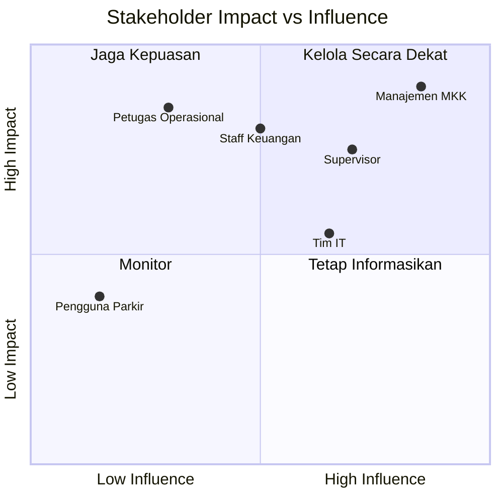

# Dampak & Model Bisnis — Sistem Parkir MKK

> **Versi**: 1.1 — Java Terminal Application
> **Mata Kuliah**: DPBO (Dasar Pemrograman Berorientasi Objek)
> **Terakhir Diperbarui**: Mei 2026
> **Referensi Elisitasi**: FR-01 s/d FR-10 (Laporan Elisitasi RKPL)

---

## 1. Business Model Canvas

```
┌───────────────────────────────────────────────────────────────────────────────────────┐
│                    BUSINESS MODEL CANVAS — SISTEM PARKIR MKK                         │
├────────────────┬────────────────┬───────────────┬────────────────┬────────────────────┤
│                │                │               │                │                    │
│  KEY PARTNERS  │ KEY ACTIVITIES │    VALUE       │  CUSTOMER      │  CUSTOMER          │
│                │                │  PROPOSITION   │  RELATIONSHIPS │  SEGMENTS          │
│  • Vendor IoT  │ • Monitoring   │               │                │                    │
│    (kamera,    │   operasional  │ • Zero fraud   │ • Self-service │ • Petugas          │
│    gate)       │   parkir       │   di pintu     │   via terminal │   Operasional      │
│  • Pengelola   │ • Validasi     │   keluar       │ • Training     │   (harian)         │
│    lahan       │   visual       │ • Auto-billing │   awal 1x      │ • Supervisor       │
│    parkir      │ • Rekonsiliasi │   server-side  │ • Laporan      │   (pengawas)       │
│  • Tim IT      │   keuangan     │ • Audit trail  │   otomatis     │ • Staff Keuangan   │
│    internal    │ • Laporan      │   100%         │                │   (finance)        │
│                │   otomatis     │ • Transparansi │                │ • Manajemen MKK    │
│                │                │   keuangan     │                │   (decision maker) │
│                │                │                │                │                    │
├────────────────┴────────────────┤               ├────────────────┴────────────────────┤
│                                 │               │                                     │
│  KEY RESOURCES                  │               │  CHANNELS                           │
│                                 │               │                                     │
│  • Aplikasi Java (terminal)     │               │  • Terminal di setiap pos parkir     │
│  • Server komputer di pos      │               │  • Laptop supervisor                 │
│  • Data kendaraan in-memory    │               │  • PC kantor keuangan                │
│  • SDM: petugas, supervisor    │               │                                     │
│                                 │               │                                     │
├─────────────────────────────────┴───────────────┴─────────────────────────────────────┤
│                                                                                       │
│  COST STRUCTURE                              │  REVENUE STREAMS                       │
│                                              │                                        │
│  • Gaji petugas (existing)                   │  • Tarif parkir per jam               │
│  • Maintenance hardware (existing)           │    - Motor: Rp 2.000/jam              │
│  • Development software (one-time)           │    - Mobil: Rp 5.000/jam              │
│  • Training pengguna (one-time)              │  • Denda tiket hilang: Rp 25.000     │
│                                              │  • Penghematan dari fraud prevention  │
│                                                                                       │
└───────────────────────────────────────────────────────────────────────────────────────┘
```

---

## 2. Analisis Masalah & Biaya (Cost of Inaction)

### 2.1 Pain Points Saat Ini (As-Is)

> *Divalidasi melalui wawancara langsung dengan Supervisor (Ibu Runi) dan Staf Keuangan (Pak Dea) PT. MKK pada 30 April 2026.*

| No | Masalah | Sumber Validasi | Dampak Finansial | Frekuensi |
|----|---------|-----------------|------------------|-----------|
| 1 | Kehilangan motor di area parkir. Penanganan saat ini pakai asuransi — reaktif, bukan preventif. | Wawancara Ibu Runi (Supervisor) | Ganti rugi per motor Rp 5-15 juta | 2-3 kasus/bulan |
| 2 | **Tiket tidak mencantumkan nomor pelat** — celah utama yang bisa dimanfaatkan untuk tindak kejahatan. | Wawancara Pak Dea (Staf Keuangan) | Kebocoran Rp 500.000-1.000.000/hari | Harian |
| 3 | Modus tiket hilang (fraud). Tidak ada kontrol digital. | Wawancara Ibu Runi + Pak Dea | Kehilangan pendapatan + kendaraan | 5-10 kasus/bulan |
| 4 | Ketidakcocokan laporan keuangan akibat **human error** dari komponen manual. | Wawancara Pak Dea | Waktu audit +2 hari/bulan | Bulanan |
| 5 | **Full cashless pernah gagal** — settlement dana butuh 2 hari, transaksi gagal menyebabkan dana pending. | Wawancara Pak Dea | Dana tidak tercatat, kerugian tidak terukur | Intermittent |

### 2.2 Estimasi Kerugian Tahunan (Tanpa Sistem)

```
┌────────────────────────────────────────────────────────┐
│         ESTIMASI KERUGIAN TAHUNAN (AS-IS)              │
├────────────────────────────────┬───────────────────────┤
│ Kehilangan Motor               │                       │
│   3 motor/bulan × Rp 10 juta   │ Rp  360.000.000/tahun │
│ Kebocoran Tarif                 │                       │
│   Rp 750.000/hari × 365 hari   │ Rp  273.750.000/tahun │
│ Fraud Tiket Hilang              │                       │
│   8 kasus/bulan × Rp 500.000   │ Rp   48.000.000/tahun │
│ Biaya Audit Tambahan            │                       │
│   2 hari/bulan × Rp 1.000.000  │ Rp   24.000.000/tahun │
├────────────────────────────────┼───────────────────────┤
│ TOTAL ESTIMASI KERUGIAN        │ Rp  705.750.000/tahun │
└────────────────────────────────┴───────────────────────┘
```

---

## 3. Dampak Implementasi (To-Be)

### 3.1 Projected Impact

| Area | Before (As-Is) | After (To-Be) | Improvement |
|------|----------------|---------------|-------------|
| Kehilangan Motor | 2-3 kasus/bulan | 0-1 kasus/bulan | **↓ 70%** |
| Manipulasi Tarif | Rp 750K/hari | Rp 0 (auto-billing) | **↓ 100%** |
| Fraud Tiket Hilang | 8 kasus/bulan | 2 kasus/bulan (legit) | **↓ 75%** |
| Waktu Audit | 4 hari/bulan | 1 hari/bulan | **↓ 75%** |
| Waktu Proses Keluar | 3-5 menit | 1-2 menit | **↓ 60%** |
| Transparansi Keuangan | Manual reconcile | Auto-reconcile | **↑ 100%** |

### 3.2 ROI (Return on Investment)

```
┌────────────────────────────────────────────────────────┐
│              ANALISIS ROI — SISTEM PARKIR MKK          │
├────────────────────────────────┬───────────────────────┤
│ BIAYA IMPLEMENTASI (One-Time)  │                       │
│   Development (4 mahasiswa)    │ Rp   0 (tugas kuliah) │
│   Hardware tambahan            │ Rp   0 (existing PC)  │
│   Training pengguna            │ Rp   5.000.000        │
│   ─────────────────────────────┼───────────────────────┤
│   Total Biaya                  │ Rp   5.000.000        │
├────────────────────────────────┼───────────────────────┤
│ PENGHEMATAN TAHUNAN            │                       │
│   Pengurangan kehilangan motor │ Rp 252.000.000        │
│   Eliminasi manipulasi tarif   │ Rp 273.750.000        │
│   Pengurangan fraud tiket hilang│ Rp  36.000.000       │
│   Pengurangan biaya audit      │ Rp  18.000.000        │
│   ─────────────────────────────┼───────────────────────┤
│   Total Penghematan            │ Rp 579.750.000/tahun  │
├────────────────────────────────┼───────────────────────┤
│ ROI                            │ 11.495%               │
│ Break-even                     │ ~3 hari               │
└────────────────────────────────┴───────────────────────┘
```

> *Catatan: ROI sangat tinggi karena biaya development Rp 0 (tugas akademik). Dalam skenario nyata, perlu diperhitungkan biaya developer profesional.*

---

## 4. Stakeholder Impact Matrix

### 4.1 Dampak per Stakeholder



### 4.2 Detail Dampak per Stakeholder

| Stakeholder | Dampak Positif | Dampak Negatif | Strategi |
|-------------|---------------|----------------|----------|
| **Manajemen MKK** | Transparansi tinggi, fraud ↓, pendapatan ↑ | Biaya awal implementasi | Showcase ROI, demo langsung |
| **Supervisor** | Monitoring real-time, audit trail lengkap | Perlu belajar sistem baru | Training + user manual |
| **Staff Keuangan** | Laporan otomatis, rekonsiliasi mudah | Workflow berubah | Pendampingan transisi |
| **Petugas Operasional** | Proses lebih terstruktur, risiko salah ↓ | Tidak bisa manipulasi tarif | Sosialisasi manfaat sistem |
| **Pengguna Parkir** | Proses keluar lebih cepat, lebih aman | Minimal impact | Signage informasi |

---

## 5. Key Performance Indicators (KPI)

### 5.1 KPI Operasional

| KPI | Target | FR Ref | Cara Ukur |
|-----|--------|--------|-----------|
| Insiden kehilangan kendaraan | ≤ 1 kasus/bulan | FR-01 | Log VALIDASI_GAGAL + laporan security |
| Rata-rata waktu proses keluar | < 2 menit | FR-01, FR-05 | Selisih waktu scan tiket vs gate terbuka |
| Uptime sistem | > 99% (dalam jam operasional) | Business Rule E | Monitoring manual |
| Akurasi auto-billing | 100% | FR-02 | Rekonsiliasi harian |
| Fraud detection rate | 100% manipulasi terdeteksi | FR-09 | Rule-Based Fraud Detection auto-flag |

### 5.2 KPI Keuangan

| KPI | Target | FR Ref | Cara Ukur |
|-----|--------|--------|-----------|
| Selisih rekonsiliasi harian | < Rp 5.000 | FR-07 | Modul rekonsiliasi kas |
| Fraud detection rate | 100% manipulasi terdeteksi | FR-09 | Audit trail + log anomali |
| Peningkatan pendapatan bersih | ↑ 15% YoY | — | Perbandingan laporan keuangan |
| Pembayaran digital real-time | Konfirmasi ≤ 5 detik | FR-08 | Monitoring transaksi cashless |

### 5.3 KPI User Satisfaction

| KPI | Target | Cara Ukur |
|-----|--------|-----------|
| Keluhan petugas | < 2 per minggu | Feedback manual |
| Waktu training pengguna baru | < 1 jam | Sesi training |
| Error rate penggunaan | < 5% dari total transaksi | Log error sistem |

---

## 6. Value Chain Analysis

```
┌──────────────────────────────────────────────────────────────────┐
│                     VALUE CHAIN — SISTEM PARKIR MKK              │
├──────────────────────────────────────────────────────────────────┤
│                                                                  │
│  AKTIVITAS UTAMA (Primary Activities)                            │
│                                                                  │
│  ┌──────────┐  ┌──────────┐  ┌──────────┐  ┌──────────┐        │
│  │ Kendaraan│→ │ Pencatatan│→ │ Validasi │→ │ Transaksi│→ VALUE │
│  │ Masuk    │  │ Data     │  │ Keluar   │  │ & Bayar  │        │
│  │          │  │          │  │          │  │          │        │
│  │ • Scan   │  │ • Simpan │  │ • Visual │  │ • Auto-  │        │
│  │   plat   │  │   data   │  │   check  │  │   billing│        │
│  │ • Foto   │  │ • Tiket  │  │ • Protect│  │ • Struk  │        │
│  │   visual │  │   unik   │  │   aset   │  │ • Log    │        │
│  └──────────┘  └──────────┘  └──────────┘  └──────────┘        │
│                                                                  │
│  AKTIVITAS PENDUKUNG (Support Activities)                        │
│                                                                  │
│  ┌──────────────────────────────────────────────────────┐       │
│  │  Monitoring & Audit (Supervisor)                      │       │
│  │  Laporan Keuangan (Finance)                           │       │
│  │  Manajemen Pengguna (Admin)                           │       │
│  │  Infrastruktur Teknologi (IT)                         │       │
│  └──────────────────────────────────────────────────────┘       │
│                                                                  │
└──────────────────────────────────────────────────────────────────┘
```

---

## 7. Risk Assessment

### 7.1 Matriks Risiko

| ID | Risiko | Probabilitas | Dampak | Level | Mitigasi |
|----|--------|:------------:|:------:|:-----:|----------|
| R1 | Data hilang saat aplikasi restart (in-memory) | 🔴 Tinggi | 🟡 Sedang | **Tinggi** | Pre-load data dummy, migrasi ke DB di fase 2 |
| R2 | Petugas bypass sistem (proses manual) | 🟡 Sedang | 🔴 Tinggi | **Tinggi** | SOP wajib + audit trail + sanksi |
| R3 | Petugas keberatan dengan sistem baru | 🟡 Sedang | 🟡 Sedang | **Sedang** | Training komprehensif + sosialisasi manfaat |
| R4 | Hardware failure (PC pos parkir) | 🟢 Rendah | 🔴 Tinggi | **Sedang** | Backup PC di setiap pos |
| R5 | Kesalahan input data oleh petugas | 🟡 Sedang | 🟢 Rendah | **Rendah** | Input validation + format guide |
| R6 | Simultaneous access conflict | 🟢 Rendah | 🟡 Sedang | **Rendah** | Single instance per terminal |

### 7.2 Risk Matrix Visual

```
              DAMPAK
         Rendah  Sedang  Tinggi
        ┌───────┬───────┬───────┐
Tinggi  │       │  R1   │       │  PROBABILITAS
        ├───────┼───────┼───────┤
Sedang  │  R5   │  R3   │  R2   │
        ├───────┼───────┼───────┤
Rendah  │       │  R6   │  R4   │
        └───────┴───────┴───────┘
```

---

## 8. Analisis Psikologi Pengguna (Marketing Psychology)

### 8.1 Loss Aversion — Mengapa Manajemen Harus Approve

> *"Kerugian terasa 2x lebih menyakitkan daripada keuntungan yang setara"*

**Framing untuk manajemen**: "Setiap bulan tanpa sistem ini, perusahaan kehilangan ~Rp 48 juta dari fraud dan kehilangan kendaraan."

### 8.2 Status-Quo Bias — Resistensi Petugas

> *"Orang cenderung mempertahankan keadaan saat ini"*

**Mitigasi**: Minimalkan perubahan workflow. Sistem dirancang agar petugas hanya perlu **3 langkah** (scan → validasi → bayar). Lebih cepat dari proses manual.

### 8.3 IKEA Effect — Ownership oleh Tim

> *"Orang lebih menghargai sesuatu yang mereka ikut 'buat'"*

**Strategi**: Libatkan supervisor dan petugas senior dalam UAT (User Acceptance Testing). Feedback mereka dimasukkan ke sistem.

### 8.4 Goal-Gradient Effect — Adopsi Bertahap

> *"Orang lebih termotivasi ketika merasa mendekati tujuan"*

**Strategi**: Implementasi bertahap (Phase 1 → 2 → 3). Setiap fase menunjukkan progress dan quick wins.

---

## 9. Competitive Advantage

| Aspek | Proses Manual (Sekarang) | Sistem Parkir MKK | Kompetitor (Jukir/PARKEE) | Keunggulan MKK |
|-------|-------------------------|-------------------|---------------------------|----------------|
| Tarif | Dihitung manual oleh petugas | Otomatis oleh server (FR-02) | Auto-billing + QR code | Eliminasi human error & fraud, read-only |
| Validasi keluar | Tidak ada verifikasi | Wajib validasi visual (FR-01) | — (hanya LPR) | Pencurian kendaraan ↓ 70% |
| Laporan keuangan | Manual di spreadsheet | Otomatis real-time (FR-07) | Cloud-based dashboard | Hemat waktu audit 75%, export PDF/Excel |
| Audit trail | Tidak ada | 100% tercatat (FR-09) | Partial | Transparansi penuh + fraud detection otomatis |
| Tiket hilang | Prosedur tidak jelas | Terstandarisasi + log (FR-03) | — | Fraud tiket hilang ↓ 75% |
| Pembayaran cashless | Gagal (settlement 2 hari) | Real-time tanpa jeda (FR-08) | QRIS/e-wallet/RFID (PARKEE) | Menjawab kegagalan cashless sebelumnya |
| Skalabilitas | Tidak scalable | Bisa migrasi ke web/DB | Cloud-native | Future-ready |

> *Data kompetitor diperoleh dari telaah sistem Jukir (PT Tekno Sari Indonesia) dan PARKEE (PT Inovasi Anak Indonesia) — lihat laporan elisitasi Bab 2.2.2*
