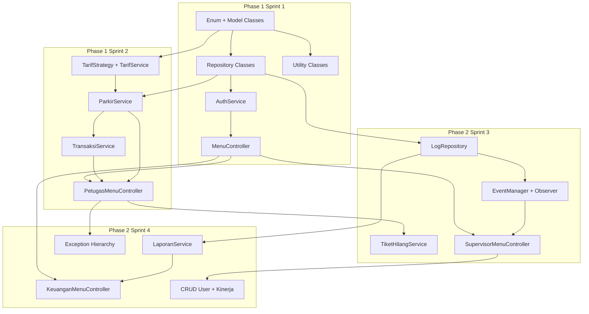

# Roadmap & Product Backlog — Sistem Parkir MKK

> **Versi**: 1.0 — Java Terminal Application
> **Mata Kuliah**: DPBO (Dasar Pemrograman Berorientasi Objek)
> **Terakhir Diperbarui**: April 2026

---

## Product Vision

> **Untuk** PT. Mandiri Kreasi Kolaborasi (MKK)
> **Yang** mengalami kerugian dari fraud parkir dan kehilangan kendaraan,
> **Sistem Parkir MKK** adalah aplikasi manajemen parkir terintegrasi
> **Yang** menghilangkan manipulasi tarif, mewajibkan validasi visual, dan mengotomatisasi laporan keuangan.
> **Berbeda dari** proses manual saat ini,
> **Produk ini** memberikan transparansi 100% dan audit trail menyeluruh.

---

## Roadmap Overview

```
┌───────────────────────────────────────────────────────────────────────────────────┐
│                          PRODUCT ROADMAP — SISTEM PARKIR MKK                     │
├───────────────────────────────────────────────────────────────────────────────────┤
│                                                                                   │
│  PHASE 1 (MVP)           PHASE 2              PHASE 3              PHASE 4       │
│  Semester Ini             Semester Ini          Berikutnya           Future        │
│  ┌──────────────┐   ┌──────────────┐   ┌──────────────┐   ┌──────────────┐      │
│  │ Core System  │   │ Extended     │   │ Persistent   │   │ Full Digital │      │
│  │              │   │ Features     │   │ Storage      │   │ Integration  │      │
│  │ • Login/Auth │   │ • Dashboard  │   │ • JDBC/SQLite│   │ • Web UI     │      │
│  │ • Masuk      │   │ • Laporan    │   │ • File Export│   │ • REST API   │      │
│  │ • Keluar     │   │ • Log        │   │ • Multi-     │   │ • IoT Camera │      │
│  │ • Auto-bill  │   │ • CRUD User  │   │   terminal   │   │ • QRIS/eWallet│     │
│  │ • Validasi   │   │ • Tiket      │   │ • Session    │   │ • AI Detect  │      │
│  │              │   │   Hilang     │   │   Persist    │   │ • Mobile App │      │
│  └──────┬───────┘   └──────┬───────┘   └──────┬───────┘   └──────────────┘      │
│         │                  │                   │                                  │
│    Week 1-3           Week 3-5             Next Semester          Future Dev      │
│                                                                                   │
│  ────●─────────────────●─────────────────●─────────────────●──→                  │
│     NOW              MID              END              FUTURE                     │
│                                                                                   │
└───────────────────────────────────────────────────────────────────────────────────┘
```

---

## Phase 1: Core System (MVP)

**Target**: Minggu 1-3
**Goal**: Sistem dasar yang bisa berjalan — login, kendaraan masuk, keluar, dan auto-billing.

### Sprint 1 (Minggu 1): Foundation

| ID | Task | Assignee | Story Points | Status |
|----|------|----------|:------------:|:------:|
| P1-001 | Setup project structure (packages, Main.java) | All | 2 | ☐ |
| P1-002 | Buat semua Enum (Role, StatusTiket, JenisKendaraan, JenisTransaksi) | Dev 1 | 2 | ☐ |
| P1-003 | Buat model User (abstract) + 3 subclass | Dev 1 | 5 | ☐ |
| P1-004 | Buat model Kendaraan, TiketParkir | Dev 2 | 3 | ☐ |
| P1-005 | Buat model Transaksi | Dev 2 | 2 | ☐ |
| P1-006 | Buat semua Repository (UserRepo, KendaraanRepo, TiketParkirRepo, TransaksiRepo) | Dev 3 | 5 | ☐ |
| P1-007 | Buat utility: ConsoleHelper, IdGenerator, DateTimeHelper | Dev 4 | 5 | ☐ |
| P1-008 | Buat utility: PasswordHasher, InputValidator | Dev 4 | 3 | ☐ |
| P1-009 | Buat AuthService (Singleton) + login/logout | Dev 1 | 5 | ☐ |
| P1-010 | Buat MenuController + routing per role | Dev 3 | 3 | ☐ |
| P1-011 | Data dummy: user default (4 orang) | All | 1 | ☐ |
| | **Total Sprint 1** | | **36** | |

### Sprint 2 (Minggu 2): Core Operations

| ID | Task | Assignee | Story Points | Status |
|----|------|----------|:------------:|:------:|
| P1-012 | Buat TarifStrategy (interface) + TarifNormalStrategy | Dev 1 | 3 | ☐ |
| P1-013 | Buat TarifService (Strategy context) | Dev 1 | 2 | ☐ |
| P1-014 | Buat ParkirService: registrasiMasuk() | Dev 2 | 5 | ☐ |
| P1-015 | Buat ValidasiService: validasiVisual() | Dev 2 | 3 | ☐ |
| P1-016 | Buat ParkirService: prosesKeluar() | Dev 2 | 8 | ☐ |
| P1-017 | Buat TransaksiService: prosesTransaksi() | Dev 3 | 5 | ☐ |
| P1-018 | Buat PetugasMenuController (menu + alur masuk) | Dev 3 | 5 | ☐ |
| P1-019 | Buat PetugasMenuController (alur keluar + bayar) | Dev 4 | 8 | ☐ |
| P1-020 | Testing alur lengkap: masuk → keluar → bayar | All | 3 | ☐ |
| P1-021 | Data dummy: 3 kendaraan pre-loaded | All | 1 | ☐ |
| | **Total Sprint 2** | | **43** | |

---

## Phase 2: Extended Features

**Target**: Minggu 3-5
**Goal**: Fitur tambahan — tiket hilang, dashboard, laporan, manajemen user.

### Sprint 3 (Minggu 3-4): Tiket Hilang + Monitoring

| ID | Task | Assignee | Story Points | Status |
|----|------|----------|:------------:|:------:|
| P2-001 | Buat model LogAktivitas, LogTiketHilang | Dev 1 | 3 | ☐ |
| P2-002 | Buat LogRepository | Dev 1 | 3 | ☐ |
| P2-003 | Buat TarifTiketHilangStrategy | Dev 2 | 3 | ☐ |
| P2-004 | Buat TiketHilangService | Dev 2 | 8 | ☐ |
| P2-005 | Buat PetugasMenuController: alur tiket hilang | Dev 2 | 5 | ☐ |
| P2-006 | Buat EventType, EventManager, EventListener | Dev 3 | 5 | ☐ |
| P2-007 | Buat AktivitasLogger (Observer implementation) | Dev 3 | 3 | ☐ |
| P2-008 | Integrate Observer ke semua service | Dev 3 | 5 | ☐ |
| P2-009 | Buat SupervisorMenuController: dashboard statistik | Dev 4 | 5 | ☐ |
| P2-010 | Buat SupervisorMenuController: log aktivitas + filter | Dev 4 | 5 | ☐ |
| P2-011 | Buat SupervisorMenuController: flag suspicious | Dev 4 | 3 | ☐ |
| P2-012 | Testing alur tiket hilang lengkap | All | 3 | ☐ |
| | **Total Sprint 3** | | **51** | |

### Sprint 4 (Minggu 4-5): Laporan + User Management

| ID | Task | Assignee | Story Points | Status |
|----|------|----------|:------------:|:------:|
| P2-013 | Buat LaporanService: laporanHarian() | Dev 1 | 5 | ☐ |
| P2-014 | Buat LaporanService: detailTransaksi() | Dev 1 | 3 | ☐ |
| P2-015 | Buat LaporanService: laporanTiketHilang() | Dev 2 | 3 | ☐ |
| P2-016 | Buat LaporanService: rekonsiliasi() | Dev 2 | 5 | ☐ |
| P2-017 | Buat KeuanganMenuController (semua menu) | Dev 2 | 8 | ☐ |
| P2-018 | Buat UserFactory | Dev 3 | 2 | ☐ |
| P2-019 | Buat SupervisorMenuController: CRUD user | Dev 3 | 5 | ☐ |
| P2-020 | Buat SupervisorMenuController: kinerja petugas | Dev 3 | 3 | ☐ |
| P2-021 | Buat DataMasker (mask KTP, STNK) | Dev 4 | 2 | ☐ |
| P2-022 | Buat Exception hierarchy (semua custom exception) | Dev 4 | 5 | ☐ |
| P2-023 | Global error handling di semua controller | Dev 4 | 3 | ☐ |
| P2-024 | Fitur ganti password (semua role) | Dev 1 | 3 | ☐ |
| P2-025 | Testing end-to-end semua skenario demo | All | 5 | ☐ |
| | **Total Sprint 4** | | **52** | |

---

## Phase 3: Persistent Storage (Opsional — Semester Berikutnya)

**Target**: Semester berikutnya
**Goal**: Migrasi dari in-memory ke database persistent.

| ID | Task | Prioritas | Story Points |
|----|------|:---------:|:------------:|
| P3-001 | Setup SQLite/H2 embedded database | Must | 5 |
| P3-002 | Buat SQL schema (CREATE TABLE) | Must | 5 |
| P3-003 | Refactor UserRepository → JDBC implementation | Must | 8 |
| P3-004 | Refactor KendaraanRepository → JDBC | Must | 5 |
| P3-005 | Refactor TiketParkirRepository → JDBC | Must | 8 |
| P3-006 | Refactor TransaksiRepository → JDBC | Must | 5 |
| P3-007 | Refactor LogRepository → JDBC | Must | 5 |
| P3-008 | File export laporan (TXT/CSV) | Should | 5 |
| P3-009 | Data migration tool (dummy → DB) | Should | 3 |
| P3-010 | Connection pooling | Could | 5 |
| | **Total Phase 3** | | **54** |

---

## Phase 4: Full Digital Integration (Future Vision)

**Target**: Future development
**Goal**: Transformasi menjadi sistem parkir digital penuh.

| ID | Task | Prioritas | Keterangan |
|----|------|:---------:|-----------|
| P4-001 | Web UI (HTML/CSS/JS atau framework) | Must | Menggantikan terminal |
| P4-002 | REST API (Spring Boot) | Must | Backend untuk web/mobile |
| P4-003 | Integrasi kamera LPR (ALPR) | Should | Auto-detect plat nomor |
| P4-004 | Integrasi kamera wajah | Should | Auto-capture wajah masuk |
| P4-005 | Pembayaran QRIS/e-wallet | Should | Cashless payment |
| P4-006 | Mobile app untuk supervisor | Could | Remote monitoring |
| P4-007 | AI anomaly detection | Could | Auto-flag suspicious |
| P4-008 | Multi-location support | Could | Kelola banyak lokasi |
| P4-009 | Report dashboard (charts) | Should | Visualisasi data |
| P4-010 | Notifikasi real-time | Could | Push notification |

---

## Product Backlog (Prioritized)

### Prioritas: 🔴 Must | 🟡 Should | 🟢 Could

| Rank | ID | User Story / Feature | Prioritas | Phase | SP |
|:----:|:----:|---------------------|:---------:|:-----:|:--:|
| 1 | US-PO-01 | Login ke sistem | 🔴 | 1 | 3 |
| 2 | P1-003 | Model User abstract + subclass | 🔴 | 1 | 5 |
| 3 | P1-006 | Semua Repository classes | 🔴 | 1 | 5 |
| 4 | P1-009 | AuthService (Singleton) | 🔴 | 1 | 5 |
| 5 | US-PO-02 | Registrasi kendaraan masuk | 🔴 | 1 | 5 |
| 6 | US-PO-03 | Simulasi capture visual | 🔴 | 1 | 3 |
| 7 | US-PO-04 | Proses kendaraan keluar | 🔴 | 1 | 5 |
| 8 | US-PO-05 | Auto-billing | 🔴 | 1 | 3 |
| 9 | US-PO-06 | Validasi visual | 🔴 | 1 | 3 |
| 10 | US-PO-07 | Proses pembayaran | 🔴 | 1 | 5 |
| 11 | US-PO-08 | Penanganan tiket hilang | 🔴 | 2 | 8 |
| 12 | P2-006 | Observer pattern (EventManager) | 🟡 | 2 | 5 |
| 13 | US-SV-02 | Dashboard statistik | 🟡 | 2 | 5 |
| 14 | US-SV-03 | Log aktivitas | 🟡 | 2 | 5 |
| 15 | US-SK-02 | Laporan pendapatan harian | 🟡 | 2 | 5 |
| 16 | US-SK-03 | Detail semua transaksi | 🟡 | 2 | 5 |
| 17 | US-SK-04 | Laporan tiket hilang | 🟡 | 2 | 3 |
| 18 | US-SV-04 | Manajemen pengguna (Tambah) | 🟡 | 2 | 3 |
| 19 | P2-022 | Exception hierarchy | 🟡 | 2 | 5 |
| 20 | US-SK-05 | Rekonsiliasi kas | 🟢 | 2 | 5 |
| 21 | US-SV-05 | Hapus user | 🟢 | 2 | 3 |
| 22 | US-SV-06 | Kinerja petugas | 🟢 | 2 | 5 |
| 23 | US-SV-07 | Flag suspicious | 🟢 | 2 | 3 |
| 24 | US-SK-06 | Export laporan ke console | 🟢 | 2 | 3 |

---

## Dependency Graph



---

## Velocity & Capacity Planning

### Estimasi Velocity

| Sprint | Durasi | Story Points Planned | Status |
|:------:|:------:|:-------------------:|:------:|
| Sprint 1 | Minggu 1 | 36 SP | ☐ Planned |
| Sprint 2 | Minggu 2 | 43 SP | ☐ Planned |
| Sprint 3 | Minggu 3-4 | 51 SP | ☐ Planned |
| Sprint 4 | Minggu 4-5 | 52 SP | ☐ Planned |
| **Total** | **5 Minggu** | **182 SP** | |

### Pembagian Tim

| Anggota | Peran | Fokus Utama |
|---------|-------|-------------|
| **Rhaihan Aditya H.** | Lead / Dev 1 | Model classes, AuthService, Strategy pattern |
| **Muhammad Faiq** | Dev 2 | ParkirService, TiketHilangService, KeuanganMenu |
| **Glenn Akhtar F.** | Dev 3 | Repository, EventManager, SupervisorMenu |
| **Bagas Luhur P.** | Dev 4 | Utility classes, PetugasMenu, Exception handling |

---

## Definition of Done (DoD)

Sebuah task dianggap **selesai** jika:

- [x] Kode Java sudah compile tanpa error
- [x] Semua method sudah memiliki Javadoc comment
- [x] Encapsulation diterapkan (atribut private, getter/setter)
- [x] Tidak ada hardcoded values (gunakan konstanta)
- [x] Input validation diterapkan untuk user input
- [x] Error handling menggunakan custom exception
- [x] Sudah ditest manual dengan skenario normal dan edge case
- [x] Konsisten dengan class diagram di dokumentasi

---

## Milestones

| Milestone | Target | Deliverable | Kriteria Sukses |
|-----------|--------|-------------|-----------------|
| **M1: Alpha** | Minggu 2 | Login + Masuk + Keluar + Bayar berjalan | Demo skenario 1 berhasil |
| **M2: Beta** | Minggu 4 | Semua fitur termasuk tiket hilang + dashboard | Demo semua 5 skenario berhasil |
| **M3: Release** | Minggu 5 | Polishing, error handling, dokumentasi final | Semua edge case tertangani |
| **M4: Presentasi** | Sesuai jadwal | Demo ke dosen + laporan | Sistem stabil, kode rapi |
