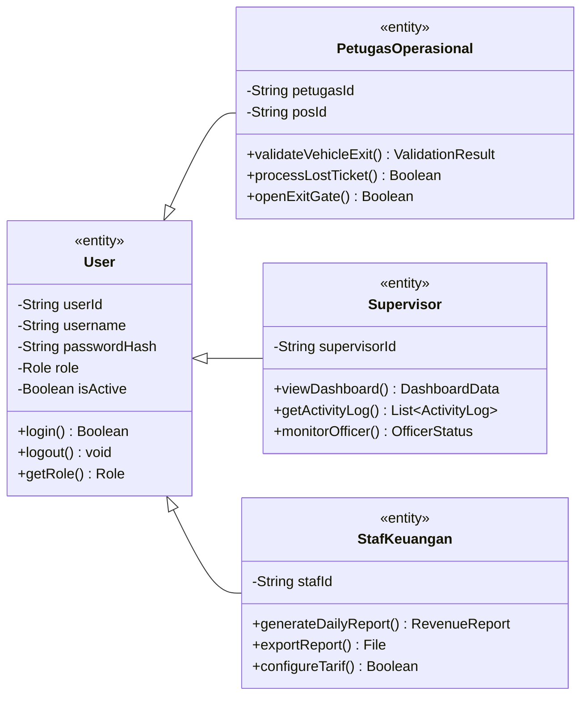
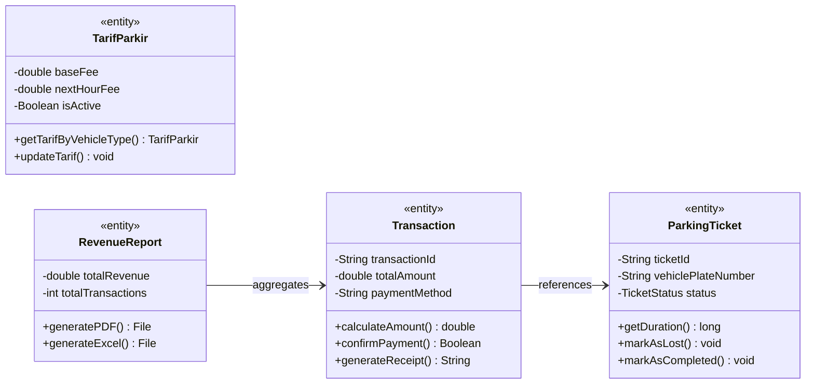
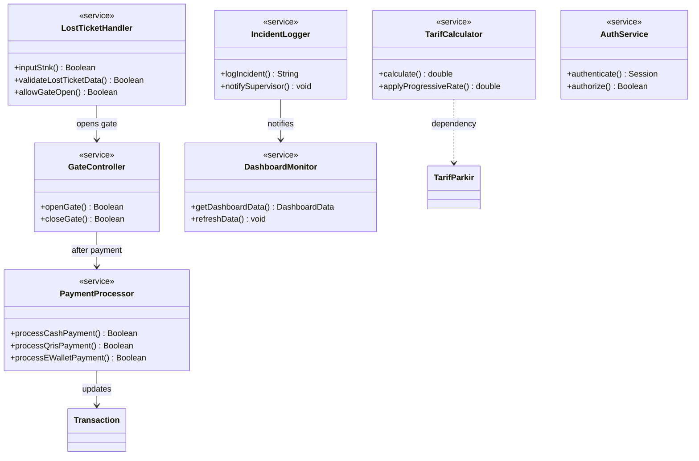

# LAPORAN PERANCANGAN CLASS DIAGRAM

**Progress Report Tugas Besar — Dasar Pemrograman Berorientasi Objek**

| | |
|---|---|
| **Nama Kelompok** | JUKIR — Kelompok SE-49-01 |
| **Anggota Kelompok** | Rhaihan Aditya Hidayat (103022500105), Glenn Akhtar Fawwaz (103022530002), Alvin Bagaskara (103022530032), Muhammad Faiq (103022500101), Bagas Luhur Pagundi (103022500021) |
| **Dosen Pengampu** | Fadil Al Afgani, S.Kom., M.Kom. (FLF) |
| **Mata Kuliah** | Pemrograman Berorientasi Objek (PBO) |
| **Semester** | Genap 2025/2026 |
| **Tanggal Pengumpulan** | Mei 2026 |

---

## 1. Pendahuluan

Laporan ini merupakan progress report perancangan class diagram untuk proyek tugas besar mata kuliah Pemrograman Berorientasi Objek (PBO). Proyek yang dikembangkan adalah sistem **JUKIR** — Sistem Manajemen Parkir Berbasis Web dengan Validasi Visual dan Otomasi Transaksi pada PT. Mandiri Kreasi Kolaborasi (MKK).

Topik ini dipilih berdasarkan hasil analisis kebutuhan (elisitasi) dari mata kuliah Rekayasa Kebutuhan Perangkat Lunak (RKPL) yang mengidentifikasi tiga masalah utama pada sistem parkir PT. MKK saat ini: (1) tidak adanya validasi visual berbasis sistem di pintu keluar, (2) tiket parkir tidak memuat identitas kendaraan sehingga menjadi celah manipulasi, dan (3) pencatatan pendapatan yang tidak akurat akibat proses manual. Sistem JUKIR dirancang untuk menutup celah-celah tersebut melalui otomasi, validasi digital, dan integrasi data.

## 2. Tujuan

Laporan ini bertujuan untuk mendokumentasikan dan menjelaskan class diagram yang akan digunakan dalam implementasi kode pemrograman sistem JUKIR, serta menggambarkan relasi antar class yang akan diimplementasikan. Secara spesifik, laporan ini mencakup:

a. Deskripsi 16 class beserta atribut (tipe data) dan metode (tipe pengembalian).
b. Penjelasan fungsional setiap class dalam konteks sistem parkir.
c. Relasi antar class (generalisasi, asosiasi, dan dependensi).

---

## 3. Class Diagram (Mermaid)

### 3.1 Diagram Utama — Seluruh 16 Kelas

```mermaid
classDiagram
    direction TB

    %% ============================================================
    %% LAYER 1: USER HIERARCHY (Generalisasi / Inheritance)
    %% ============================================================

    class User {
        <<entity>>
        -String userId
        -String username
        -String passwordHash
        -Role role
        -Boolean isActive
        -DateTime createdAt
        +login(username: String, password: String) Boolean
        +logout() void
        +getRole() Role
        +validateCredentials(password: String) Boolean
        +updatePassword(newPassword: String) void
    }

    class PetugasOperasional {
        <<entity>>
        -String petugasId
        -String posId
        -DateTime shiftStart
        -DateTime shiftEnd
        -int totalTransaksiHarian
        +validateVehicleExit(ticketId: String) ValidationResult
        +processLostTicket(stnk: String, ktpPhotoPath: String) Boolean
        +confirmPayment(transactionId: String) Boolean
        +openExitGate(ticketId: String) Boolean
        +getShiftSummary() ShiftSummary
    }

    class Supervisor {
        <<entity>>
        -String supervisorId
        -String divisiArea
        -DateTime lastLoginDashboard
        +viewDashboard() DashboardData
        +getActivityLog(startDate: Date, endDate: Date) List~ActivityLog~
        +getIncidentReport() List~Incident~
        +monitorOfficer(petugasId: String) OfficerStatus
    }

    class StafKeuangan {
        <<entity>>
        -String stafId
        -String divisi
        -DateTime lastExportDate
        +generateDailyReport(date: Date) RevenueReport
        +generateMonthlyReport(month: int, year: int) RevenueReport
        +exportReport(reportId: String, format: String) File
        +configureTarif(tarifData: TarifParkir) Boolean
        +getRevenueChart(startDate: Date, endDate: Date) ChartData
    }

    %% Inheritance
    User <|-- PetugasOperasional
    User <|-- Supervisor
    User <|-- StafKeuangan

    %% ============================================================
    %% LAYER 2: CORE DOMAIN ENTITIES
    %% ============================================================

    class ParkingTicket {
        <<entity>>
        -String ticketId
        -String vehiclePlateNumber
        -DateTime entryTime
        -String vehiclePhotoPath
        -String driverFacePhotoPath
        -String vehicleType
        -TicketStatus status
        -String entryGateId
        +getEntryPhoto() String
        +getDriverFacePhoto() String
        +markAsLost() void
        +markAsCompleted() void
        +getDuration() long
        +isValid() Boolean
    }

    class Transaction {
        <<entity>>
        -String transactionId
        -String ticketId
        -String petugasId
        -DateTime entryTime
        -DateTime exitTime
        -long duration
        -double totalAmount
        -String paymentMethod
        -String status
        +calculateAmount() double
        +confirmPayment() Boolean
        +recordToDatabase() void
        +getPaymentStatus() String
        +generateReceipt() String
    }

    class TarifParkir {
        <<entity>>
        -String tarifId
        -String vehicleType
        -double baseFee
        -double firstHourFee
        -double nextHourFee
        -double maxDailyFee
        -Date effectiveDate
        -Boolean isActive
        +getTarifByVehicleType(type: String) TarifParkir
        +activate() void
        +deactivate() void
        +updateTarif(baseFee: double, nextHour: double) void
    }

    class VehicleExitQueue {
        <<entity>>
        -String queueId
        -String gateId
        -List~ParkingTicket~ pendingVehicles
        -String currentTicketId
        -DateTime createdAt
        +addToQueue(ticket: ParkingTicket) void
        +getCurrentVehicle() ParkingTicket
        +processNext() Boolean
        +getQueueLength() int
        +removeFromQueue(ticketId: String) void
    }

    class RevenueReport {
        <<entity>>
        -String reportId
        -String reportType
        -Date periodStart
        -Date periodEnd
        -double totalRevenue
        -int totalTransactions
        -Map~String, Double~ breakdown
        -String generatedBy
        -DateTime generatedAt
        +generatePDF() File
        +generateExcel() File
        +getTotalRevenue() double
        +getTransactionCount() int
        +getRevenueByVehicleType() Map~String, Double~
    }

    %% ============================================================
    %% LAYER 3: SERVICE CLASSES
    %% ============================================================

    class TarifCalculator {
        <<service>>
        -TarifParkir currentTarif
        +calculate(entryTime: DateTime, exitTime: DateTime, vehicleType: String) double
        +getDuration(entryTime: DateTime, exitTime: DateTime) long
        +applyProgressiveRate(duration: long, tarif: TarifParkir) double
        +getActiveTarif(vehicleType: String) TarifParkir
    }

    class GateController {
        <<service>>
        -String gateId
        -String gateStatus
        -DateTime lastActionTime
        -String lastActionBy
        +openGate() Boolean
        +closeGate() Boolean
        +getGateStatus() String
        +triggerAutoClose(delaySeconds: int) void
        +logAction(action: String, userId: String) void
    }

    class LostTicketHandler {
        <<service>>
        -String incidentId
        -String petugasId
        -String vehicleStnkNumber
        -String ktpPhotoPath
        -DateTime incidentTime
        -Boolean isResolved
        +inputStnk(stnk: String) Boolean
        +uploadKtpPhoto(photoPath: String) Boolean
        +validateLostTicketData() Boolean
        +saveLostTicketRecord() String
        +allowGateOpen() Boolean
    }

    class DashboardMonitor {
        <<service>>
        -String dashboardId
        -DateTime lastRefreshed
        -List~PetugasOperasional~ activeOfficers
        -int todayTransactionCount
        -double todayRevenue
        -List~Incident~ flaggedIncidents
        +getDashboardData() DashboardData
        +refreshData() void
        +getActiveOfficers() List~PetugasOperasional~
        +getTodaySummary() TransactionSummary
        +getRecentTransactions(limit: int) List~Transaction~
    }

    class IncidentLogger {
        <<service>>
        -String incidentId
        -String incidentType
        -String description
        -String petugasId
        -DateTime timestamp
        -String ticketId
        -Boolean isPermanent
        +logIncident(type: String, desc: String, petugasId: String) String
        +notifySupervisor(incidentId: String) void
        +getIncidentById(id: String) Incident
        +getAllIncidents(filter: IncidentFilter) List~Incident~
    }

    class PaymentProcessor {
        <<service>>
        -String processorId
        -List~String~ supportedMethods
        -String lastTransactionId
        +processCashPayment(amount: double, transactionId: String) Boolean
        +processQrisPayment(qrisCode: String, amount: double) Boolean
        +processEWalletPayment(walletType: String, amount: double) Boolean
        +getPaymentStatus(transactionId: String) String
        +onPaymentSuccess(transactionId: String) void
    }

    class AuthService {
        <<service>>
        -Map~String, Session~ activeSessions
        -int sessionTimeout
        +authenticate(username: String, password: String) Session
        +authorize(userId: String, feature: String) Boolean
        +invalidateSession(sessionId: String) void
        +getSessionUser(sessionId: String) User
        +isSessionValid(sessionId: String) Boolean
    }

    %% ============================================================
    %% LAYER 4: ENUMERASI
    %% ============================================================

    class Role {
        <<enumeration>>
        PETUGAS
        SUPERVISOR
        STAF_KEUANGAN
    }

    class TicketStatus {
        <<enumeration>>
        ACTIVE
        COMPLETED
        LOST
    }

    class PaymentMethod {
        <<enumeration>>
        CASH
        QRIS
        EWALLET
    }

    class GateStatus {
        <<enumeration>>
        OPEN
        CLOSED
        ERROR
    }

    class IncidentType {
        <<enumeration>>
        LOST_TICKET
        SUSPICIOUS_ACTIVITY
        MANUAL_OVERRIDE
    }

    %% ============================================================
    %% RELASI (sesuai Bab 5 Laporan)
    %% ============================================================

    %% Authentication
    AuthService --> User : authenticates

    %% Petugas operations
    PetugasOperasional --> VehicleExitQueue : processes
    PetugasOperasional --> Transaction : confirms
    PetugasOperasional --> GateController : triggers

    %% Queue & Ticket
    VehicleExitQueue o-- ParkingTicket : contains

    %% Transaction core
    Transaction --> ParkingTicket : references

    %% Tarif
    TarifCalculator ..> TarifParkir : uses config
    TarifCalculator --> Transaction : calculates amount

    %% Staf Keuangan
    StafKeuangan --> TarifParkir : configures
    StafKeuangan --> RevenueReport : generates

    %% Report
    RevenueReport --> Transaction : aggregates

    %% Gate & Payment
    GateController --> PaymentProcessor : opens after payment
    PaymentProcessor --> Transaction : updates status

    %% Lost Ticket
    LostTicketHandler --> PetugasOperasional : used by
    LostTicketHandler --> ParkingTicket : marks as LOST
    LostTicketHandler --> GateController : opens gate

    %% Incident & Dashboard
    IncidentLogger --> LostTicketHandler : logs incident
    IncidentLogger --> DashboardMonitor : notifies
    DashboardMonitor --> Supervisor : accessed by
    DashboardMonitor --> Transaction : displays

    %% Enum usage
    User --> Role : has
    ParkingTicket --> TicketStatus : has
    Transaction --> PaymentMethod : has
    GateController --> GateStatus : has
    IncidentLogger --> IncidentType : has
```

---

### 3.2 Diagram Per-Layer (Simplified)

#### A. User Hierarchy — Generalisasi (Inheritance)

> **Konsep OOP**: Inheritance — `PetugasOperasional`, `Supervisor`, dan `StafKeuangan` mewarisi atribut dan metode dari `User`. Setiap subclass memiliki metode khusus sesuai peran (**Polymorphism**).

#### B. Core Domain — Entity & Asosiasi

> **Konsep OOP**: Encapsulation — setiap field bersifat `private (-)`, diakses melalui metode `public (+)`.

#### C. Service Layer — Asosiasi & Dependensi

---

## 4. Penjelasan Class Diagram

| No | Class | Kategori | Fungsi dalam Sistem |
|----|-------|----------|---------------------|
| 1 | **User** | Entity | Superclass semua pengguna. Menyimpan kredensial autentikasi dan digunakan oleh AuthService. |
| 2 | **PetugasOperasional** | Entity | Subclass User — petugas di pos pintu keluar. Memproses validasi, tiket hilang, dan pembayaran. |
| 3 | **Supervisor** | Entity | Subclass User — pengawas operasional. Akses dashboard real-time dan log aktivitas. |
| 4 | **StafKeuangan** | Entity | Subclass User — pengelola keuangan. Konfigurasi tarif dan export laporan. |
| 5 | **ParkingTicket** | Entity | Tiket parkir digital. Menyimpan foto kendaraan, wajah pengemudi, dan status tiket. |
| 6 | **Transaction** | Entity | Catatan transaksi pembayaran parkir. Detail tarif, metode bayar, dan status. |
| 7 | **TarifParkir** | Entity | Konfigurasi tarif progresif berdasarkan durasi dan jenis kendaraan. |
| 8 | **TarifCalculator** | Service | Menghitung biaya parkir otomatis. Tidak bisa dimodifikasi manual oleh petugas. |
| 9 | **VehicleExitQueue** | Entity | Antrian kendaraan di pintu keluar. Petugas memproses satu per satu. |
| 10 | **GateController** | Service | Kontrol buka/tutup barrier gate otomatis setelah validasi/pembayaran berhasil. |
| 11 | **LostTicketHandler** | Service | Prosedur tiket hilang — wajib input STNK dan foto KTP sebelum gate bisa dibuka. |
| 12 | **DashboardMonitor** | Service | Data real-time untuk Supervisor — kendaraan diproses, petugas aktif, insiden. |
| 13 | **IncidentLogger** | Service | Log insiden permanen. Notifikasi otomatis ke dashboard Supervisor ≤5 detik. |
| 14 | **PaymentProcessor** | Service | Proses pembayaran tunai/QRIS/e-wallet. Konfirmasi real-time. |
| 15 | **RevenueReport** | Entity | Laporan keuangan harian/bulanan. Export PDF dan Excel. |
| 16 | **AuthService** | Service | Autentikasi + otorisasi RBAC. Kelola sesi login. |

---

## 5. Relasi Antar Kelas

| Class A | Relasi | Class B | Keterangan |
|---------|:------:|---------|------------|
| User | **Generalisasi** | PetugasOperasional | User adalah superclass dari PetugasOperasional |
| User | **Generalisasi** | Supervisor | User adalah superclass dari Supervisor |
| User | **Generalisasi** | StafKeuangan | User adalah superclass dari StafKeuangan |
| AuthService | Asosiasi | User | AuthService mengautentikasi User dan mengelola sesi |
| PetugasOperasional | Asosiasi | VehicleExitQueue | Petugas memproses antrian kendaraan keluar |
| VehicleExitQueue | Agregasi | ParkingTicket | Antrian berisi daftar tiket parkir aktif |
| PetugasOperasional | Asosiasi | Transaction | Petugas memproses dan mengkonfirmasi transaksi |
| Transaction | Asosiasi | ParkingTicket | Setiap transaksi terhubung ke satu tiket parkir |
| TarifCalculator | **Dependensi** | TarifParkir | Calculator menggunakan konfigurasi tarif aktif |
| TarifCalculator | Asosiasi | Transaction | Calculator menghitung nilai total transaksi |
| StafKeuangan | Asosiasi | TarifParkir | StafKeuangan mengonfigurasi tarif parkir |
| StafKeuangan | Asosiasi | RevenueReport | StafKeuangan men-generate dan mengekspor laporan |
| RevenueReport | Asosiasi | Transaction | Laporan dihasilkan dari agregasi transaksi |
| GateController | Asosiasi | PetugasOperasional | Petugas memicu perintah buka/tutup gate |
| GateController | Asosiasi | PaymentProcessor | Gate terbuka otomatis setelah pembayaran sukses |
| LostTicketHandler | Asosiasi | PetugasOperasional | Petugas menginput data untuk tiket hilang |
| LostTicketHandler | Asosiasi | ParkingTicket | Handler memperbarui status tiket menjadi LOST |
| LostTicketHandler | Asosiasi | GateController | Handler membuka gate setelah data lengkap |
| IncidentLogger | Asosiasi | LostTicketHandler | Setiap tiket hilang dicatat sebagai insiden |
| IncidentLogger | Asosiasi | DashboardMonitor | Logger notifikasi insiden ke dashboard supervisor |
| DashboardMonitor | Asosiasi | Supervisor | Supervisor mengakses data real-time dari dashboard |
| DashboardMonitor | Asosiasi | Transaction | Dashboard menampilkan data transaksi terkini |
| PaymentProcessor | Asosiasi | Transaction | Processor memperbarui status dan mencatat transaksi |

---

## 6. Referensi Tambahan

Perancangan class diagram sistem JUKIR ini mengacu pada:

a. Hasil elisitasi kebutuhan dari laporan RKPL kelompok (wawancara Supervisor Ibu Runi dan Staf Keuangan Pak Dea).
b. Functional Requirements (FR-01 s.d. FR-10) yang telah didefinisikan dalam laporan RKPL.
c. Business rules operasional PT. MKK (validasi sebelum buka gate, kalkulasi otomatis, penanganan tiket hilang, RBAC).
d. Benchmarking sistem kompetitor: Jukir (Android) dan PARKEE (Android/iOS).

---

## 7. Pembagian Tugas Anggota

| Nama | NIM | Peran | Tanggung Jawab |
|------|-----|-------|----------------|
| Rhaihan Aditya Hidayat | 103022500105 | Project Manager / Ketua | Koordinasi keseluruhan, review, dan Bab 1 |
| Glenn Akhtar Fawwaz | 103022530002 | Anggota | Bab 3 (Tabel Class Diagram — class 1-4) |
| Alvin Bagaskara | 103022530032 | Anggota | Bab 3 (Tabel Class Diagram — class 5-8) |
| Muhammad Faiq | 103022500101 | Anggota | Bab 3 (class 9-12), Bab 4, Bab 5 |
| Bagas Luhur Pagundi | 103022500021 | Anggota | Bab 3 (class 13-16), Bab 6, Bab 7 |
