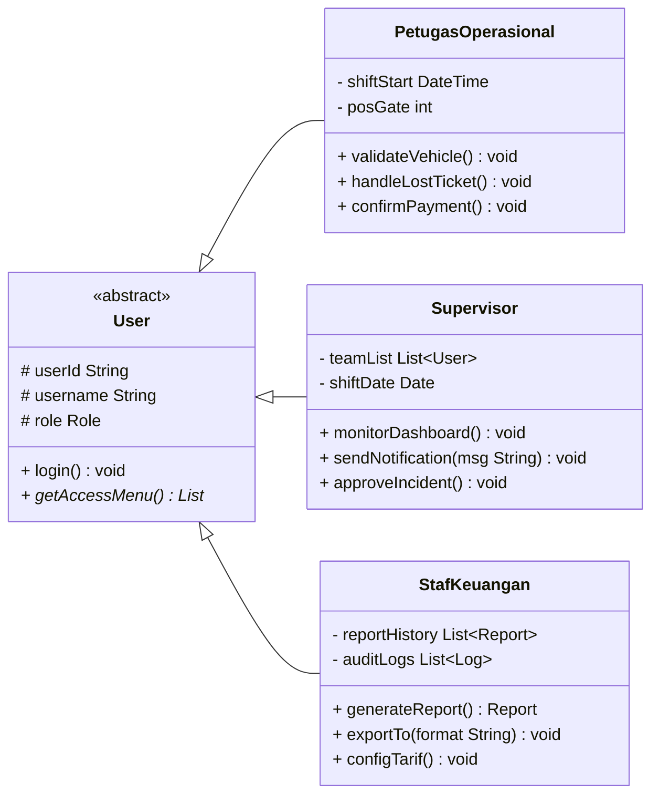
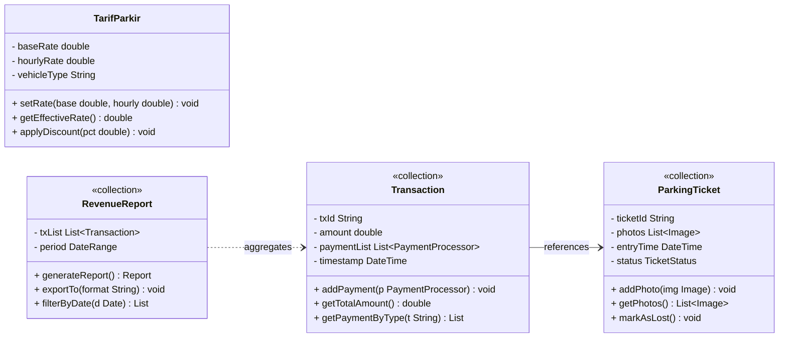
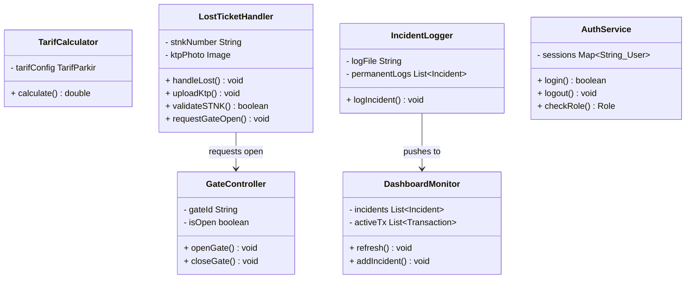

# LAPORAN PERANCANGAN CLASS DIAGRAM

**Progress Report Tugas Besar — Dasar Pemrograman Berorientasi Objek**

| | |
|---|---|
| **Nama Kelompok** | JUKIR — Kelompok SE-49-01 |
| **Anggota Kelompok** | Rhaihan Aditya Hidayat (103022500105), Glenn Akhtar Fawwaz (103022530002), Alvin Bagaskara (103022530032), Muhammad Faiq (103022500101), Bagas Luhur Pagundi (103022500021) |
| **Dosen Pengampu** | Fadil Al Afgani, S.Kom., M.Kom. (FLF) |
| **Mata Kuliah** | Pemrograman Berorientasi Objek (PBO) |
| **Semester** | Genap 2025/2026 |
| **Tanggal Pengumpulan** | Mei 2026 |

---

## 1. Pendahuluan

Laporan ini merupakan progress report perancangan class diagram untuk proyek tugas besar mata kuliah Pemrograman Berorientasi Objek (PBO). Proyek yang dikembangkan adalah sistem **JUKIR** — Sistem Manajemen Parkir Berbasis Web dengan Validasi Visual dan Otomasi Transaksi pada PT. Mandiri Kreasi Kolaborasi (MKK).

Topik ini dipilih berdasarkan hasil analisis kebutuhan (elisitasi) dari mata kuliah Rekayasa Kebutuhan Perangkat Lunak (RKPL) yang mengidentifikasi tiga masalah utama pada sistem parkir PT. MKK saat ini: (1) tidak adanya validasi visual berbasis sistem di pintu keluar, (2) tiket parkir tidak memuat identitas kendaraan sehingga menjadi celah manipulasi, dan (3) pencatatan pendapatan yang tidak akurat akibat proses manual. Sistem JUKIR dirancang untuk menutup celah-celah tersebut melalui otomasi, validasi digital, dan integrasi data.

## 2. Tujuan

Laporan ini bertujuan untuk mendokumentasikan dan menjelaskan class diagram yang akan digunakan dalam implementasi kode pemrograman sistem JUKIR, serta menggambarkan relasi antar class yang akan diimplementasikan. Secara spesifik, laporan ini mencakup:

a. Deskripsi 16 class beserta atribut (tipe data) dan metode (tipe pengembalian).
b. Penjelasan fungsional setiap class dalam konteks sistem parkir.
c. Relasi antar class (generalisasi, asosiasi, dan dependensi).

---

## 3. Class Diagram (Mermaid)

### 3.1 Diagram Utama — Seluruh 16```mermaid
classDiagram

%% ─────────────────────────────────────────────
%% INTERFACES
%% ─────────────────────────────────────────────

class IPayable {
    <<interface>>
    + processPayment() void
    + getStatus() String
}

class IReportable {
    <<interface>>
    + generateReport() Report
    + exportTo(format String) void
}

class INotifiable {
    <<interface>>
    + sendNotification(msg String) void
    + getNotifLog() List
}

class IGateControllable {
    <<interface>>
    + openGate() void
    + closeGate() void
}

%% ─────────────────────────────────────────────
%% ABSTRACT CLASSES
%% ─────────────────────────────────────────────

class User {
    <<abstract>>
    # userId String
    # username String
    # role Role
    + login() void
    + getAccessMenu() List*
}

class PaymentProcessor {
    <<abstract>>
    # amount double
    # paymentTime DateTime
    + processPayment() void*
    + validatePayment() void
    + getStatus() String*
}

%% ─────────────────────────────────────────────
%% CONCRETE USER SUBCLASSES
%% ─────────────────────────────────────────────

class PetugasOperasional {
    - shiftStart DateTime
    - posGate int
    + validateVehicle() void
    + handleLostTicket() void
    + confirmPayment() void
    + getAccessMenu() List
}

class Supervisor {
    - teamList List~User~
    - shiftDate Date
    + monitorDashboard() void
    + sendNotification(msg String) void
    + approveIncident() void
    + getAccessMenu() List
}

class StafKeuangan {
    - reportHistory List~Report~
    - auditLogs List~Log~
    + generateReport() Report
    + exportTo(format String) void
    + configTarif() void
    + getAccessMenu() List
}

%% ─────────────────────────────────────────────
%% CONCRETE PAYMENT SUBCLASSES
%% ─────────────────────────────────────────────

class CashPayment {
    - receivedAmount double
    + processPayment() void
    + calcChange() double
    + getStatus() String
}

class QrisPayment {
    - qrToken String
    + processPayment() void
    + confirmRealtime() void
    + getStatus() String
}

%% ─────────────────────────────────────────────
%% COLLECTION CLASSES
%% ─────────────────────────────────────────────

class Transaction {
    <<collection>>
    - txId String
    - amount double
    - paymentList List~PaymentProcessor~
    - timestamp DateTime
    + addPayment(p PaymentProcessor) void
    + getTotalAmount() double
    + getPaymentByType(t String) List
}

class ParkingTicket {
    <<collection>>
    - ticketId String
    - photos List~Image~
    - entryTime DateTime
    - status TicketStatus
    + addPhoto(img Image) void
    + getPhotos() List~Image~
    + markAsLost() void
}

class VehicleExitQueue {
    <<collection>>
    - queue Queue~ParkingTicket~
    - maxCapacity int
    + enqueue(t ParkingTicket) void
    + dequeue() ParkingTicket
    + getQueueSize() int
}

class RevenueReport {
    <<collection>>
    - txList List~Transaction~
    - period DateRange
    + generateReport() Report
    + exportTo(format String) void
    + filterByDate(d Date) List
}

class DashboardMonitor {
    <<collection>>
    - incidents List~Incident~
    - activeTx List~Transaction~
    + refresh() void
    + addIncident(i Incident) void
    + getActiveOfficers() List
}

%% ─────────────────────────────────────────────
%% CONCRETE CLASSES
%% ─────────────────────────────────────────────

class TarifCalculator {
    - tarifConfig TarifParkir
    + calculate(minutes int) double
    + calculate(entry DateTime, exit DateTime) double
    + calculate(ticket ParkingTicket) double
    + calculate(minutes int, type String) double
}

class GateController {
    - gateId String
    - isOpen boolean
    + openGate() void
    + closeGate() void
    + getStatus() String
}

class LostTicketHandler {
    - stnkNumber String
    - ktpPhoto Image
    + handleLost() void
    + uploadKtp(img Image) void
    + validateSTNK() boolean
    + requestGateOpen() void
}

class TarifParkir {
    - baseRate double
    - hourlyRate double
    - vehicleType String
    + setRate(base double, hourly double) void
    + getEffectiveRate() double
    + applyDiscount(pct double) void
}

class AuthService {
    - sessions Map~String_User~
    + login(u String, p String) boolean
    + logout(userId String) void
    + checkRole(u User) Role
    + hasPermission(u User, feature String) boolean
}

class IncidentLogger {
    - logFile String
    - permanentLogs List~Incident~
    + logIncident(i Incident) void
    + sendNotification(msg String) void
    + getLogs() List~Incident~
}

%% ─────────────────────────────────────────────
%% INHERITANCE (User hierarchy)
%% ─────────────────────────────────────────────
User <|-- PetugasOperasional
User <|-- Supervisor
User <|-- StafKeuangan

%% INHERITANCE (PaymentProcessor hierarchy)
PaymentProcessor <|-- CashPayment
PaymentProcessor <|-- QrisPayment

%% ─────────────────────────────────────────────
%% INTERFACE IMPLEMENTATIONS
%% ─────────────────────────────────────────────
IPayable <|.. PaymentProcessor
IReportable <|.. StafKeuangan
INotifiable <|.. Supervisor
INotifiable <|.. IncidentLogger
IGateControllable <|.. GateController

%% ─────────────────────────────────────────────
%% ASSOCIATIONS
%% ─────────────────────────────────────────────
PetugasOperasional --> PaymentProcessor : uses
PetugasOperasional --> VehicleExitQueue : manages
CashPayment ..> Transaction : recorded in
Transaction --> ParkingTicket : linked to
TarifCalculator --> TarifParkir : uses config
LostTicketHandler ..> ParkingTicket : looks up
LostTicketHandler --> GateController : requests open
Supervisor --> DashboardMonitor : monitors
StafKeuangan --> RevenueReport : generates
StafKeuangan --> TarifParkir : configures
RevenueReport ..> Transaction : aggregates
IncidentLogger --> DashboardMonitor : pushes to
AuthService ..> User : manages sessions
VehicleExitQueue ..> ParkingTicket : queues
```

---

### 3.2 Diagram Per-Layer (Simplified)

#### A. Hierarchy User — Generalisasi (Inheritance)



> **Konsep OOP**: Inheritance — `PetugasOperasional`, `Supervisor`, dan `StafKeuangan` mewarisi atribut dan metode dari `User`. Setiap subclass memiliki metode khusus sesuai peran (**Polymorphism**).

#### B. Core Domain — Entity & Asosiasi



> **Konsep OOP**: Encapsulation — setiap field bersifat `private (-)` atau `protected (#)` dan diakses melalui metode `public (+)`.

#### C. Service Layer — Asosiasi & Dependensi



---

## 4. Penjelasan Class Diagram

| No | Class / Interface | Kategori | Fungsi dalam Sistem |
|----|-------------------|----------|---------------------|
| 1 | **IPayable** | Interface | Kontrak untuk pemrosesan pembayaran dan pengecekan status pembayaran. |
| 2 | **IReportable** | Interface | Kontrak untuk pembuatan laporan keuangan dan pengeksporan laporan ke format tertentu. |
| 3 | **INotifiable** | Interface | Kontrak untuk pengiriman notifikasi ke supervisor dan pencatatan log notifikasi. |
| 4 | **IGateControllable** | Interface | Kontrak untuk pengoperasian palang pintu parkir (buka/tutup). |
| 5 | **User** | Abstract Class | Kelas dasar pengguna sistem (userId, username, role, login). |
| 6 | **PaymentProcessor** | Abstract Class | Kelas dasar pemrosesan pembayaran parkir yang mengimplementasikan IPayable. |
| 7 | **PetugasOperasional** | Concrete Class | Petugas pintu keluar parkir yang bertugas memproses antrean keluar, tiket hilang, dan pembayaran. |
| 8 | **Supervisor** | Concrete Class | Pengawas operasional yang memantau dashboard, menyetujui insiden tiket hilang, dan menerima notifikasi. |
| 9 | **StafKeuangan** | Concrete Class | Pengelola administrasi keuangan yang bertugas membuat laporan dan mengonfigurasi tarif parkir. |
| 10 | **CashPayment** | Concrete Class | Pemroses pembayaran dengan uang tunai serta menghitung uang kembalian. |
| 11 | **QrisPayment** | Concrete Class | Pemroses pembayaran menggunakan kode QRIS non-tunai secara realtime. |
| 12 | **Transaction** | Collection Class | Kumpulan data transaksi pembayaran parkir yang mencakup daftar sub-pembayaran. |
| 13 | **ParkingTicket** | Collection Class | Data tiket parkir digital kendaraan, riwayat foto dokumentasi, dan status tiket. |
| 14 | **VehicleExitQueue** | Collection Class | Antrean kendaraan yang sedang mengantre keluar di gerbang parkir. |
| 15 | **RevenueReport** | Collection Class | Kumpulan transaksi pendapatan dalam periode waktu tertentu yang dikelola oleh Staf Keuangan. |
| 16 | **DashboardMonitor** | Collection Class | Dashboard real-time untuk memantau insiden aktif dan transaksi yang sedang berjalan. |
| 17 | **TarifCalculator** | Concrete Class | Komponen penghitung tarif parkir progresif otomatis berdasarkan durasi dan jenis kendaraan. |
| 18 | **GateController** | Concrete Class | Pengendali fisik gerbang pintu keluar (palang pintu otomatis). |
| 19 | **LostTicketHandler** | Concrete Class | Penangan operasional khusus untuk verifikasi kelengkapan STNK dan KTP ketika tiket fisik hilang. |
| 20 | **TarifParkir** | Concrete Class | Konfigurasi nilai tarif parkir dasar dan per jam untuk setiap jenis kendaraan. |
| 21 | **AuthService** | Concrete Class | Pengelola otentikasi pengguna, otorisasi RBAC (Role-Based Access Control), dan session aktif. |
| 22 | **IncidentLogger** | Concrete Class | Logger insiden yang mencatat kejadian (seperti tiket hilang) secara permanen. |

---

## 5. Relasi Antar Kelas

| Class A | Relasi | Class B | Keterangan |
|---------|:------:|---------|------------|
| User | **Generalisasi** | PetugasOperasional | User adalah superclass dari PetugasOperasional |
| User | **Generalisasi** | Supervisor | User adalah superclass dari Supervisor |
| User | **Generalisasi** | StafKeuangan | User adalah superclass dari StafKeuangan |
| PaymentProcessor | **Generalisasi** | CashPayment | PaymentProcessor adalah superclass dari CashPayment |
| PaymentProcessor | **Generalisasi** | QrisPayment | PaymentProcessor adalah superclass dari QrisPayment |
| IPayable | **Realisasi** | PaymentProcessor | PaymentProcessor mengimplementasikan kontrak IPayable |
| IReportable | **Realisasi** | StafKeuangan | StafKeuangan mengimplementasikan kontrak IReportable |
| INotifiable | **Realisasi** | Supervisor | Supervisor mengimplementasikan kontrak INotifiable |
| INotifiable | **Realisasi** | IncidentLogger | IncidentLogger mengimplementasikan kontrak INotifiable |
| IGateControllable | **Realisasi** | GateController | GateController mengimplementasikan kontrak IGateControllable |
| PetugasOperasional | Asosiasi | PaymentProcessor | Petugas menggunakan pemroses pembayaran untuk menyelesaikan transaksi |
| PetugasOperasional | Asosiasi | VehicleExitQueue | Petugas memproses antrean keluar kendaraan |
| CashPayment | Dependensi | Transaction | Pembayaran tunai dicatat ke dalam satu objek Transaction |
| Transaction | Asosiasi | ParkingTicket | Setiap transaksi terhubung dengan satu tiket parkir |
| TarifCalculator | Asosiasi | TarifParkir | TarifCalculator menghitung biaya menggunakan konfigurasi tarif aktif |
| LostTicketHandler | Dependensi | ParkingTicket | Handler mencari data tiket parkir berdasarkan status tiket |
| LostTicketHandler | Asosiasi | GateController | Handler memicu pembukaan gerbang setelah verifikasi selesai |
| Supervisor | Asosiasi | DashboardMonitor | Supervisor memantau visual dashboard secara berkala |
| StafKeuangan | Asosiasi | RevenueReport | Staf Keuangan menghasilkan laporan pendapatan harian/bulanan |
| StafKeuangan | Asosiasi | TarifParkir | Staf Keuangan mengubah dan menentukan konfigurasi tarif parkir |
| RevenueReport | Dependensi | Transaction | Laporan pendapatan mengagregasikan banyak transaksi |
| IncidentLogger | Asosiasi | DashboardMonitor | Logger meneruskan insiden yang tercatat ke monitor dashboard |
| AuthService | Dependensi | User | AuthService mengelola daftar session aktif untuk User yang sedang login |
| VehicleExitQueue | Dependensi | ParkingTicket | Antrean menampung antrean objek tiket parkir aktif |tatus dan mencatat transaksi |

---

## 6. Referensi Tambahan

Perancangan class diagram sistem JUKIR ini mengacu pada:

a. Hasil elisitasi kebutuhan dari laporan RKPL kelompok (wawancara Supervisor Ibu Runi dan Staf Keuangan Pak Dea).
b. Functional Requirements (FR-01 s.d. FR-10) yang telah didefinisikan dalam laporan RKPL.
c. Business rules operasional PT. MKK (validasi sebelum buka gate, kalkulasi otomatis, penanganan tiket hilang, RBAC).
d. Benchmarking sistem kompetitor: Jukir (Android) dan PARKEE (Android/iOS).

---

## 7. Pembagian Tugas Anggota

| Nama | NIM | Peran | Tanggung Jawab |
|------|-----|-------|----------------|
| Rhaihan Aditya Hidayat | 103022500105 | Project Manager / Ketua | Koordinasi keseluruhan, review, dan Bab 1 |
| Glenn Akhtar Fawwaz | 103022530002 | Anggota | Bab 3 (Tabel Class Diagram — class 1-4) |
| Alvin Bagaskara | 103022530032 | Anggota | Bab 3 (Tabel Class Diagram — class 5-8) |
| Muhammad Faiq | 103022500101 | Anggota | Bab 3 (class 9-12), Bab 4, Bab 5 |
| Bagas Luhur Pagundi | 103022500021 | Anggota | Bab 3 (class 13-16), Bab 6, Bab 7 |
