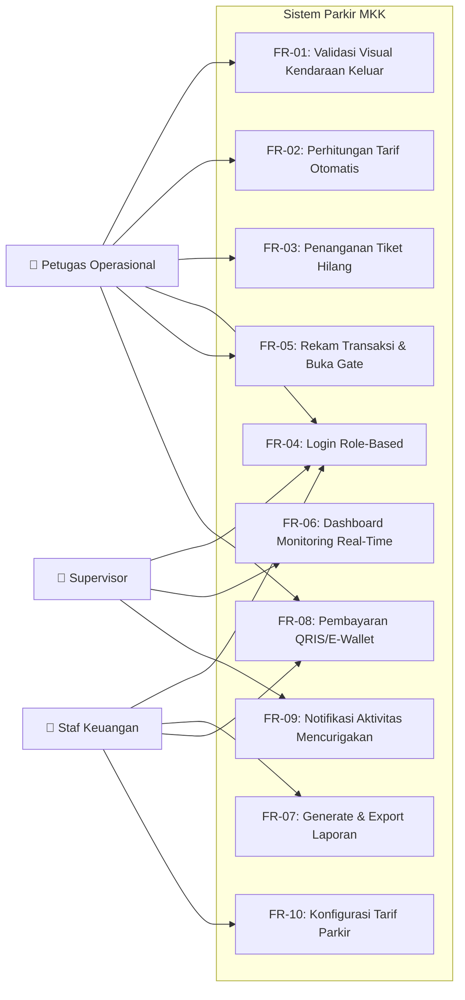

# Perancangan Sistem Parkir Terintegrasi Berbasis Web pada PT. Mandiri Kreasi Kolaborasi
*Disusun untuk memenuhi Tugas Besar Mata Kuliah Pengantar Rekayasa Perangkat Lunak*

Oleh Kelompok E
- Rhaihan Aditya Hidayat (103022500105)
- Muhammad Faiq (103022500101)
- Glenn Akhtar Fawwaz (103022530002)
- Bagas Luhur Pangudi (103022500021)

Kelas: SE-49-01
Dosen Pengampu : Fadil Al Afgani, S.Kom.,M.Kom. (FLF)
**PROGRAM STUDI S1 REKAYASA PERANGKAT LUNAK**
**FAKULTAS INFORMATIKA**
**UNIVERSITAS TELKOM**
**APRIL 2026**

***

# BAB I PENDAHULUAN

## 1.1 Latar Belakang
PT. Mandiri Kreasi Kolaborasi (MKK) adalah perusahaan yang mengelola tempat parkir dengan menggunakan sistem berbasis teknologi ERP (*Parking Management System*) yang terintegrasi dengan infrastruktur IoT seperti sistem gerbang dan kamera LPR. Visi perusahaan adalah mewujudkan sistem parkir yang efektif dan efisien. Saat ini, MKK sudah menggunakan sistem pemantauan secara real-time berdasarkan big data. Namun, dalam menjalankan operasionalnya di wilayah Jabodetabek, perusahaan masih menghadapi tantangan di bagian Operasional dan Penegakan.

Dari analisis proses saat ini, terlihat bahwa meskipun data transaksi dikumpulkan secara otomatis, masih ada kelemahan dalam aspek keamanan yang menyebabkan hilangnya kendaraan, terutama sepeda motor. Hal ini diperparah oleh minimnya data real-time yang akurat untuk audit, sehingga proses pengecekan pendapatan harian seringkali belum terintegrasi dengan baik dengan konfirmasi visual di lapangan. Situasi ini memicu ketidakseimbangan dalam kerja tim Keuangan dan Tim Pengawas dalam memastikan laporan keuangan yang transparan serta ketaatan terhadap SOP petugas.

## 1.2 Identifikasi Permasalahan
A. **Keamanan fisik kendaraan:** Resiko kehilangan motor masih tinggi karena verifikasi visual terhadap pengendara di pintu keluar masih kurang memadai.
B. **Penegakan SOP yang lemah:** Petugas di lapangan sering kali memperbolehkan transaksi manual tanpa pengawasan yang dilakukan secara real-time dan terintegrasi.
C. **Akurasi data keuangan:** Informasi yang diperoleh secara instan tidak selalu akurat, sehingga terdapat potensi perbedaan antara transaksi yang tercatat di sistem dengan pendapatan yang benar-benar terkumpul.

## 1.3 Identifikasi Pengguna
A. **Petugas Operasional (Divisi Operasional) :** Memastikan transaksi keluar berjalan lancar dan memeriksa kendaraan secara langsung.
B. **Supervisor (Divisi Pengawas) :** Mengawasi kinerja petugas dan memastikan semua prosedur yang berlaku diikuti dengan baik.
C. **Staff Keuangan (Divisi Finance) :** Mencatat setiap transaksi, membuat laporan keuangan, serta melakukan pemeriksaan internal.

## 1.4 Usulan Solusi
Untuk masalah-masalah yang telah ditemukan, kami mengusulkan untuk membuat website layanan parkir yang terintegrasi, dengan fokus pada peningkatan pengendalian di pintu keluar. Sistem ini memudahkan tugas petugas kasir dengan menggabungkan informasi dari kamera pengenalan plat nomor secara visual dan perhitungan tarif secara otomatis ke dalam satu layar. Dengan sistem ini, petugas tidak perlu lagi pengecekan secara manual yang bisa menyebabkan kesalahan, tetapi harus memastikan secara visual melalui sistem sebelum pintu bisa terbuka. Selain itu, semua uang yang masuk akan tercatat secara otomatis di sistem pusat, sehingga menghindari terjadinya kebocoran anggaran.

## 1.5 Tujuan
A. Meningkatkan keamanan kendaraan dengan memperketat proses pengecekan mata pada pintu keluar untuk mengurangi jumlah kendaraan yang hilang.
B. Menjamin kejelasan dan ketepatan laporan pendapatan dengan mengotomatisasi pemeriksaan transaksi secara langsung.
C. Mendukung tujuan perusahaan dalam membangun sistem parkir yang menggunakan teknologi dan dapat dipertanggungjawabkan.

## 1.6 Timeline Waktu Pengerjaan

| No | Aktivitas | Penanggung Jawab | Tanggal Mulai | Tanggal Selesai | Status |
|---|---|---|---|---|---|
| 1 | Pembagian Tugas | Semua Anggota | 27 November 2025 | 27 November 2025 | Selesai |
| 2 | Pengerjaan Bab 1 (Pendahuluan) | Rhaihan Aditya Hidayat & Glenn Akhtar Fawwaz | 17 Desember 2025 | 20 Desember 2025 | Selesai |
| 3 | Pengerjaan Bab 2 (Analisis Kebutuhan) | Rhaihan Aditya Hidayat & Bagas Luhur Pangudi | 17 Desember 2025 | 20 Desember 2025 | Selesai |
| 4 | Pengerjaan Bab 3.1 (Flowchart Sistem) | Muhammad Faiq | 18 Desember 2025 | 21 Desember 2025 | Selesai |
| 5 | Pengerjaan Bab 3.2 (Wireframe) | Muhammad Faiq | 22 Desember 2025 | 30 Desember 2025 | Selesai |
| 6 | Pengerjaan Bab 3.3 (Alur Navigasi) | Rhaihan Aditya Hidayat | 25 Desember 2025 | 27 Desember 2025 | Selesai |
| 7 | Pengerjaan Bab 4 (Prototype & Mockup Figma) | Rhaihan Aditya Hidayat & Muhammad Faiq | 22 Desember 2025 | 1 Januari 2026 | Selesai |
| 8 | Pengerjaan Bab 5 (Kesimpulan & Saran) | Glenn Akhtar Fawwaz | 1 Januari 2026 | 1 Januari 2026 | Selesai |

## 1.7 Pembagian Kerja Tim
- **Ketua** - Rhaihan Aditya Hidayat
- **Manajemen Proses Bisnis** - Glenn Akhtar Fawwaz - Bagas Luhur Pangudi
- **Pengantar Rekayasa Perangkat Lunak** - Rhaihan Aditya Hidayat - Muhammad Faiq

## 1.8 Referensi Yang Digunakan
Referensi yang kami gunakan adalah *company profile* yang kami dapatkan dari pegawai yang bekerja di perusahaan PT. Mandiri Kreasi Kolaborasi.
https://drive.google.com/file/d/1hYso-N6b6kUzL5z6PB5SwgArlz-zQrA6/view

***

# BAB II ANALISA KEBUTUHAN

## 2.1 Proses Bisnis As-Is dan To-Be
*(Catatan: Terdapat diagram BPMN untuk "AS-IS" dan "TO-BE" pada dokumen asli)*.

## 2.2 Kebutuhan Fungsional

Berikut adalah kebutuhan fungsional yang telah divalidasi melalui proses elisitasi (wawancara langsung dengan Supervisor dan Staf Keuangan PT. MKK, serta telaah dokumen dan sistem kompetitor). Setiap kebutuhan dipetakan ke kode FR dari laporan elisitasi.

| No | Kode FR | Masalah (As-Is) | Solusi (To-Be) | Kebutuhan Fungsional (Fitur) | Prioritas |
|---|---|---|---|---|---|
| 1 | FR-01 | **Sering Kehilangan Motor:** Petugas tidak memeriksa apakah orang yang keluar sama dengan orang yang masuk. Tiket tidak mencantumkan pelat — celah utama (dikonfirmasi Staf Keuangan). | Validasi visual wajib oleh petugas melalui sistem. | **Layar Cek Visual:** Sistem menampilkan foto kendaraan dan wajah pengendara saat masuk dalam ≤ 2 detik setelah scan tiket. Petugas memverifikasi sebelum tombol "Buka Gate" aktif. | Must Have |
| 2 | FR-02 | **Kebocoran Anggaran:** Pendapatan sering tidak sesuai karena tarif dipengaruhi oleh petugas. Human error dari komponen manual (dikonfirmasi Staf Keuangan). | Sistem menghitung tarif secara otomatis. | **Auto-Billing:** Sistem menghitung biaya parkir berdasarkan data waktu masuk yang tersimpan di server. Tarif bersifat read-only — tidak bisa diinput manual oleh kasir. | Must Have |
| 3 | FR-03 | **Penyalahgunaan "Tiket Hilang":** Modus tiket hilang digunakan untuk mencuri motor atau uang denda. | Digitalisasi prosedur tiket hilang dengan kontrol sistem. | **Log Tiket Hilang:** Petugas wajib menginput nomor STNK dan memfoto KTP pemilik kendaraan ke dalam sistem. Tombol buka gate hanya aktif setelah data lengkap. | Must Have |
| 4 | FR-04 | Tidak ada pembatasan akses berdasarkan role. | Login dengan otoritas sesuai role. | **Role-Based Access:** Sistem menyediakan login berbasis role dengan hak akses berbeda untuk Petugas Operasional, Supervisor, dan Staf Keuangan. | Must Have |
| 5 | FR-05 | Transaksi tidak tercatat otomatis ke pusat. | Otomatisasi pencatatan transaksi. | **Auto-Record & Gate:** Saat pembayaran dikonfirmasi, transaksi tersimpan otomatis ke database pusat dan barrier gate terbuka dalam ≤ 1 detik. | Must Have |
| 6 | FR-06 | Supervisor tidak bisa memantau real-time. | Dashboard monitoring. | **Dashboard Real-Time:** Menampilkan kendaraan diproses, petugas aktif, dan insiden yang ditandai. Data diperbarui otomatis ≤ 5 detik. | Satisfier |
| 7 | FR-07 | Laporan keuangan manual dan memakan waktu. | Laporan otomatis dan bisa di-export. | **Export Laporan:** Staf Keuangan bisa generate dan export laporan harian/bulanan dalam format PDF dan Excel dalam ≤ 10 detik. | Satisfier |
| 8 | FR-08 | Pembayaran cashless pernah gagal — settlement dana butuh 2 hari, transaksi pending tidak tercatat (dikonfirmasi Staf Keuangan). | Pembayaran digital real-time. | **Pembayaran QRIS/E-Wallet:** Konfirmasi pembayaran real-time tanpa jeda settlement pihak ketiga. Status langsung tercatat ≤ 5 detik. | Satisfier |
| 9 | FR-09 | Aktivitas mencurigakan tidak terdeteksi otomatis. | Notifikasi otomatis. | **Auto-Alert Suspicious:** Saat aktivitas mencurigakan terdeteksi, notifikasi otomatis muncul di dashboard Supervisor ≤ 5 detik dan log tersimpan permanen. | Delighter |
| 10 | FR-10 | Tarif parkir tidak bisa dikonfigurasi oleh staf keuangan. | Konfigurasi tarif via admin settings. | **Konfigurasi Tarif:** Staf Keuangan bisa mengatur tarif dasar dan progresif melalui admin settings. Perubahan langsung berlaku pada transaksi berikutnya. | Satisfier |

> *Referensi: Laporan Elisitasi — Tabel 2.4.2 Daftar Kebutuhan Fungsional (Format EARS)*

## 2.3 Kebutuhan Non Fungsional

Berikut adalah NFR yang telah divalidasi dan dipetakan ke kriteria keberhasilan dari elisitasi:

A. **Performa (Kecepatan) :** Foto dan tarif harus muncul dalam waktu kurang dari 2 detik setelah tiket di-scan agar tidak terjadi kemacetan di pintu keluar. Barrier gate terbuka dalam ≤ 1 detik setelah konfirmasi pembayaran. *(Ref: FR-01 dan FR-05)*
B. **Kemudahan Penggunaan (Usability) :** Proses validasi harus cepat, hanya membutuhkan maksimal 3 kali klik oleh petugas pos agar operasional tetap lancar.
C. **Keamanan (Security) :** Hak akses untuk melihat total pendapatan harian hanya diberikan kepada Divisi Keuangan dan Pengawas melalui akun login yang aman. Setiap role hanya bisa akses fitur sesuai haknya. *(Ref: FR-04)*
D. **Keterandalan (Reliability) :** Sistem harus selalu aktif 24 jam dengan tingkat ketersediaan 99,8% agar operasional parkir berjalan terus menerus. *(Ref: Business Rule E dari elisitasi)*
E. **Auditabilitas (Traceability) :** Semua aktivitas petugas tercatat otomatis di log yang tidak bisa dihapus oleh petugas. *(Ref: FR-09)*

## 2.4 Use Case Diagram

***

# BAB III PERANCANGAN SISTEM

## 3.1 Flowchart Sistem

**Mulai** -> Sensor Deteksi & Kamera Scan Wajah/Pelat -> **[Pengecekan: Punya Tiket?]**

**[Cabang: Jika Punya Tiket]**
Scan Barcode Tiket -> Sistem Tarik Data Masuk -> Sistem Hitung Durasi & Tarif Real-time -> Tampilkan Tarif & Foto Wajah Masuk di Layar

**[Cabang: Jika Tidak Punya Tiket]**
Input STNK & Foto KTP ke Sistem -> Simpan Log 'Tiket Hilang' -> Sistem Hitung Denda -> Tampilkan Tarif & Foto Wajah Masuk di Layar

*(Setelah tarif dan foto wajah masuk ditampilkan di layar, alur kembali menyatu)*
-> Proses Pembayaran -> **[Pengecekan: Lunas?]**

**[Cabang: Jika Tidak Lunas]**
-> (Kembali mengulang) Proses Pembayaran

**[Cabang: Jika Lunas]**
-> **[Pengecekan: Validasi Visual, Wajah & Motor Cocok?]**

* **[Sub-Cabang: Jika Tidak Cocok]**
  Tahan Gate & Panggil Security -> Investigasi Manual

* **[Sub-Cabang: Jika Cocok]**
  Simpan Transaksi ke Database Keuangan -> Sistem Buka Barrier Gate -> **Selesai**

## 3.2 Rancangan Antarmuka (Wireframe)
*(Catatan: Terdapat gambar wireframe antarmuka pengguna pada dokumen asli yang memuat:*
- *Login Wireframe*
- *Wireframe Scan Awal Masuk*
- *Wireframe Tiket Hilang*
- *Wireframe Scan Pembayaran Tiket*
- *Wireframe Dashboard Aktivitas*
- *Wireframe Dashboard Pendapatan)*

## 3.3 Alur Navigasi Sistem
*(Catatan: Terdapat diagram pohon Alur Navigasi Sistem berdasarkan proses Autentikasi Pengguna di dokumen asli)*.

***

# BAB IV PROTOTYPE DAN MOCKUP

## 4.1 Identifikasi Style Guide
**A. Typography (Tipografi)**
Kami menggunakan jenis font Sans-Serif modern untuk memastikan keterbacaan yang optimal pada antarmuka dashboard yang padat dengan data.
- **Font Family**: Inter
- **Hierarchy**:
  - **Headings (H1, H2)**: Digunakan untuk judul halaman. Style: Bold / Semi-Bold. Ukuran: 24px – 32px.
  - **Sub-Headings / Card Titles**: Digunakan untuk judul widget. Style: Semi-Bold. Ukuran: 16px – 18px.
  - **Body Text**: Digunakan untuk tabel data dan label form. Style: Regular / Medium. Ukuran: 14px.
  - **Captions / Labels**: Digunakan untuk teks kecil seperti timestamp atau label sumbu grafik. Style: Regular (Warna abu-abu). Ukuran: 12px.

**B. Color Palette (Palet Warna)**
Skema warna menggunakan pendekatan Clean & Professional dengan warna dominan biru untuk kepercayaan dan teknologi, serta warna semantik untuk status operasional.
- **Primary Colors (Warna Utama):**
  - **Brand Blue (#2563EB)**: Digunakan untuk tombol utama (Primary Button), elemen aktif di sidebar, header grafik, dan link. Melambangkan aksi utama.
  - **Surface White (#FFFFFF)**: Digunakan sebagai background kartu (cards), panel, dan area konten utama agar terlihat bersih.
  - **Background Grey (#F3F4F6)**: Digunakan sebagai warna latar belakang halaman (canvas) untuk memberikan kontras dengan kartu putih.
- **Semantic / Status Colors (Warna Status):**
  - **Success Green (#10B981)**: Menandakan status positif. Penggunaan: Status "Paid", "Operasional", indikator "Matching Plate: 98%", kenaikan tren (panah atas).
  - **Warning Orange/Yellow (#F59E0B)**: Menandakan status menunggu atau peringatan. Penggunaan: Status "Pending Payment", peringatan "Verify physical STNK".
  - **Danger Red (#EF4444)**: Menandakan error atau aksi destruktif. Penggunaan: Tombol "Flag Suspicious Activity", status offline, atau pembatalan.
- **Neutral Colors (Netral):**
  - **Text Black (#111827)**: Untuk teks utama (Heading).
  - **Text Grey (#6B7280)**: Untuk teks sekunder (deskripsi, placeholder input).
  - **Border Grey (#E5E7EB)**: Untuk garis pembatas tabel dan border input field.

**C. Iconography (Ikon)**
Gaya ikon yang digunakan adalah *Line / Stroke Style* (ikon garis) yang minimalis dan konsisten.
- **Style**: Outline (Garis), ketebalan garis 1.5px – 2px, sudut sedikit membulat (*rounded corners*).
- **Penggunaan**:
  - **Sidebar**: Ikon Dashboard, Activity Log, Cameras, Settings.
  - **Action**: Ikon Print (No Ticket), Scan (QR Code), Upload (Camera icon), Edit (Pencil).
  - **Stats**: Ikon Mobil, Pintu Keluar, Uang (Revenue) pada kartu statistik.

**D. UI Components (Komponen Antarmuka)**
- **Buttons (Tombol)**:
  - **Primary**: Background Biru Solid, Teks Putih, sudut membulat (Rounded 6px–8px).
  - **Secondary**: Background Putih, Border Abu-abu, Teks Hitam.
- **Input Fields**: Desain kotak dengan border tipis (1px), background putih, dan sudut membulat (Rounded 6px).
- **Cards (Kartu)**: Background putih dengan bayangan sangat tipis (*subtle shadow*) untuk memisahkan konten dari background abu-abu.

## 4.2 Desain Tampilan Layar
Petugas lapangan bertugas mengelola proses parkir sehari-hari. Setelah login, mereka bisa mengawasi kendaraan yang masuk melalui fitur live detection feed yang terhubung dengan kamera. Sistem secara otomatis mendeteksi nomor plat kendaraan dan wajah pengendaranya, lalu menampilkan hasilnya secara langsung. Saat kendaraan akan keluar, petugas memproses tiket melalui halaman pemindaian di pintu keluar. Sistem menampilkan informasi kendaraan, durasi parkir, serta jumlah uang yang harus dibayar sebelum kendaraan diperbolehkan keluar. Jika tiket hilang, petugas menggunakan fitur pengolahan tiket hilang dengan memasukkan data kendaraan dan pemilik secara manual serta mengunggah dokumen pendukung. Sistem kemudian menghitung denda secara otomatis, dan semua aktivitas petugas dicatat dalam sistem.

Staf keuangan bertugas mengelola dan mengawasi semua transaksi parkir. Setelah login, mereka diarahkan ke dashboard keuangan yang menampilkan ringkasan pendapatan, data transaksi, serta grafik tren pemasukan dalam waktu tertentu. Data ini digunakan untuk pencatatan, pelaporan, dan evaluasi keuangan. Semua informasi transaksi diperoleh secara otomatis dari aktivitas petugas lapangan.

Supervisor bertugas mengawasi dan mengevaluasi sistem secara keseluruhan. Setelah login, mereka memasuki dashboard monitoring yang menampilkan kondisi operasional parkir, statistik kendaraan masuk dan keluar, serta status sistem. Supervisor juga bisa memantau kamera melalui fitur live detection feed untuk memastikan proses deteksi berjalan baik. Semua fitur yang tersedia untuk supervisor hanya digunakan untuk memantau, tanpa intervensi langsung terhadap proses operasional.

***

# BAB V KESIMPULAN DAN SARAN

## 5.1 Kesimpulan
Melalui tugas besar ini, tim mencoba memahami permasalahan nyata yang terjadi pada sistem parkir PT. Mandiri Kreasi Kolaborasi (MKK), khususnya pada proses operasional di lapangan. Dari hasil analisis yang dilakukan, ditemukan bahwa masih terdapat kendala dalam hal keamanan kendaraan, kedisiplinan petugas terhadap SOP, serta ketepatan pencatatan pendapatan parkir. Kendala tersebut berpotensi menimbulkan kerugian bagi perusahaan apabila tidak ditangani dengan baik.

Untuk menjawab permasalahan tersebut, tim mengusulkan sebuah sistem website layanan parkir yang terintegrasi dan berfokus pada pengendalian di pintu keluar. Sistem ini dirancang untuk membantu petugas dalam melakukan pengecekan kendaraan secara visual dengan lebih mudah, sekaligus memastikan bahwa tarif parkir dihitung secara otomatis oleh sistem. Dengan begitu, proses transaksi menjadi lebih terkontrol dan transparan.

Berdasarkan hasil perancangan yang meliputi analisis kebutuhan, pemodelan proses, perancangan antarmuka, hingga pembuatan prototype, solusi yang diusulkan dinilai mampu membantu meningkatkan keamanan operasional dan akurasi data keuangan. Sistem ini juga diharapkan dapat mempermudah kerja petugas, supervisor, dan staf keuangan dalam menjalankan tugas masing-masing sesuai dengan perannya.

## 5.2 Saran
Agar sistem yang dirancang dapat terus berkembang dan memberikan manfaat yang lebih maksimal, terdapat beberapa saran yang dapat dipertimbangkan ke depannya, antara lain:

1. **Pengembangan metode pembayaran non-tunai**
   Sistem dapat dikembangkan dengan menambahkan opsi pembayaran digital seperti QRIS atau e-wallet untuk mempercepat transaksi dan mengurangi ketergantungan pada pembayaran tunai.
2. **Penyempurnaan fitur laporan dan monitoring**
   Penambahan fitur laporan otomatis dan dashboard analitik akan sangat membantu pihak manajemen dalam memantau performa operasional serta mendeteksi potensi masalah sejak dini.
3. **Peningkatan keamanan berbasis teknologi**
   Sistem dapat dikembangkan lebih lanjut dengan memanfaatkan teknologi kecerdasan buatan untuk membantu mendeteksi aktivitas mencurigakan, baik dari sisi kendaraan maupun petugas.
4. **Akses mobile untuk pengawas**
   Pengembangan aplikasi atau tampilan mobile khusus bagi supervisor dapat memudahkan proses pengawasan tanpa harus selalu berada di depan komputer.
5. **Uji coba langsung di lapangan**
   Sebelum sistem diterapkan secara menyeluruh, disarankan untuk melakukan uji coba di beberapa lokasi parkir agar sistem dapat disesuaikan dengan kondisi operasional yang sebenarnya.

Dengan adanya pengembangan berkelanjutan dan evaluasi secara rutin, sistem parkir yang dirancang diharapkan dapat menjadi solusi yang tidak hanya mendukung operasional perusahaan, tetapi juga meningkatkan kepercayaan pengguna terhadap layanan parkir yang disediakan.

***

# LAMPIRAN
**Dokumentasi Proses Pengerjaan(foto/screenshot)**

**Lembar Laporan Kegiatan Diskusi Tugas Pengantar RPL**
- **Hari/Tanggal/Waktu :** 27 November 2025
- **Tempat :** Online
- **Jumlah Peserta :** 4
- **Agenda yang dibahas :** Pembagian Tugas

| No | Topik Pembahasan/Permasalahan | Tindakan/Perbaikan | Anggota | Target Selesai | Status |
|---|---|---|---|---|---|
| 1 | Pembagian Jobdesc | - Rhaihan & Faiq: Fokus RPL (Use Case, Req, Bab 3-4). - Glenn & Bagas: Fokus Manpro (As-Is/To-Be, Bab 2) | Rhaihan, Faiq, Glenn, Bagas | 28/11/2025 | Selesai |
| 2 | Penyusunan Latar Belakang | Drafting Bab 1.1 & 1.2 tentang masalah kehilangan motor & kebocoran dana. | Rhaihan & Glenn | 29/11/2025 | Selesai |
| 3 | Identifikasi Masalah | Drafting Bab 1.2: Masalah keamanan visual & kebocoran dana operasional. | Rhaihan, Faiq, Glenn, Bagas | 29/11/2025 | Selesai |
| 4 | Diagram As-Is | Memetakan alur lama: Input manual petugas yang rawan *fraud*. | Glenn, Bagas | 18/12/2025 | Selesai |
| 5 | Diagram To-Be | Merancang alur baru: *Auto-Billing server* & Wajib Validasi Visual (System Enforced). | Glenn, Bagas | 18/12/2025 | Selesai |
| 6 | Spesifikasi NFR | Menetapkan standar kualitas: Respon < 2 detik & Max 3 klik untuk petugas. | Rhaihan | 20/12/2025 | Selesai |
| 7 | Use Case Diagram | Membagi hak akses aktor: Petugas (Operasional) vs Supervisor (Audit). | Rhaihan | 20/12/2025 | Selesai |
| 8 | Flowchart | Merancang logika algoritma penanganan 'Tiket Hilang' (Input STNK/KTP & Hitung Denda) serta logika keputusan 'Validasi Visual' (Gate otomatis *tertahan/ Looping* jika wajah tidak cocok). | Faiq | 24/12/2025 | Selesai |
| 9 | Desain UI/UX | Menentukan Style Guide: Warna Biru (#2563EB) & Font Inter. Mockup Dashboard Supervisor. | Faiq, Rhaihan | 30/12/2025 | Selesai |
| 10 | Final Check Bab 1-5 | Pengecekan sitasi, format gambar flowchart, dan konsistensi istilah As-Is/To-Be. | Rhaihan, Faiq, Glenn, Bagas | 02/01/2026 | Selesai |
| 11 | Penyusunan PPT | Membuat slide strategi: Matriks Perbandingan & Alur Logika Sistem. | Glenn, Bagas, Rhaihan | 02/01/2026 | Selesai |